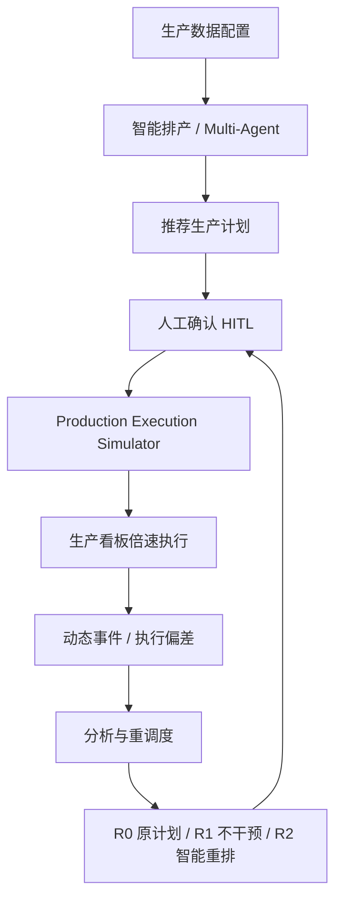
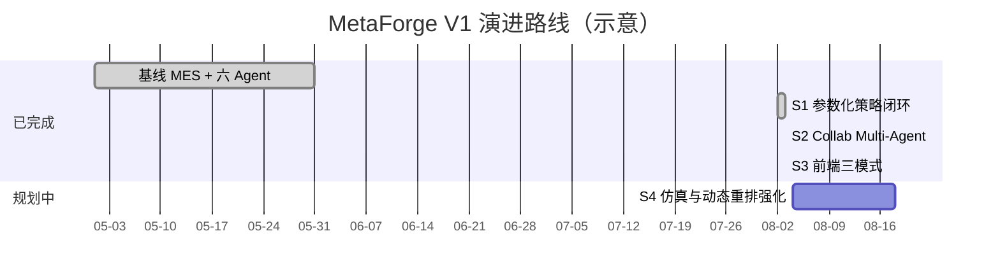
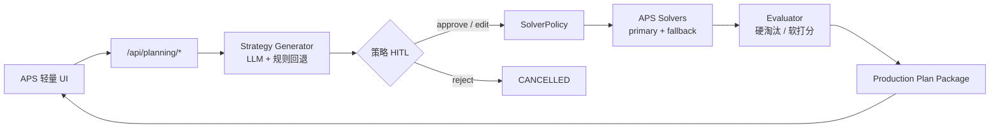
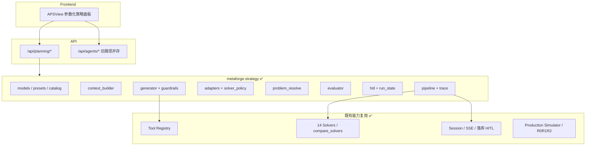
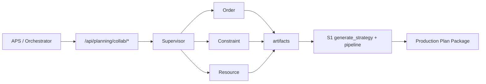

# MetaForge

MetaForge 是面向 **Job Shop 排产（JSSP）** 的模块化工具包：经典元启发式 + 强化学习求解器，并提供 **FastAPI + MongoDB + Vue3** 车间排产 Web 应用。

当前主分支：**`V1`** — 已完成 **S1 参数化策略** + **S2 Planning Collab Multi-Agent** + **S3 前端三模式**。

---

## 快速启动（Windows）

```powershell
Start-Service MongoDB
pip install -e .
cd frontend; npm install; npm run build; cd ..
cd tests; python main.py
```

- 交付入口：`http://127.0.0.1:8000/new-ui/`
- 运行手册：[`star.md`](star.md)
- 设计规格：[参数化 SchedulingStrategy](docs/superpowers/specs/2026-08-03-parameterized-scheduling-strategy-design.md)
- 实现计划：[S1 Implementation Plan](docs/superpowers/plans/2026-08-03-parameterized-scheduling-strategy.md)
- 进度文档：[`docs/多智能体开发进度.md`](docs/多智能体开发进度.md)

---

## V1 改造总览：产品主线

系统主线固定为：**先排好计划 → 再执行计划 → 最后处理异常**。



LLM **不算甘特、不改算法源码**；确定性 APS Solver 负责计算。

---

## 改造计划与完成阶段

| 阶段 | 内容 | 状态 |
|------|------|------|
| **基线** | 14 Solver、六大业务 Agent、Tool 白名单、MES 仿真与事件重排、Vue `/new-ui` | ✅ 已完成 |
| **S1** | 参数化 `SchedulingStrategy` + 评价闭环 + HITL + `/api/planning/*` + APS 轻量 UI | ✅ **已闭环** |
| **S2** | Planning Supervisor + Order/Constraint/Resource → S1；替换 scheduling 主路径 | ✅ **已闭环** |
| **S3** | 前端三模式（模板 / 参数化 / AI 策略）+ 完整结果页 | ✅ **已闭环** |
| **S4** | 推荐计划对接仿真强化 + 自动扰动 + R0/R1/R2 强化 | ⬜ 未开始 |
| **暂缓** | 全面 LangGraph / MCP / 真实 MES·IoT / 复杂 RBAC | ⏸ 不做 |


---

## S1 架构（当前已落地）

### 端到端数据流



### 模块分层



### S1 验收清单（打勾）

**策略与评价**

- [x] `SchedulingStrategy` 统一模型（objectives / hard / soft / critical_orders …）
- [x] 6 模板降级为 Preset，兼容旧 weights
- [x] 硬/软约束扩展集 + 模拟数据标记 `simulated_fields`
- [x] Context Builder（禁止全量 BOM/甘特入 Prompt）
- [x] NL → Strategy：LLM + repair/retry + 规则回退
- [x] Guardrails：约束白名单与实体校验
- [x] Adapters：Strategy → weights / resource hints
- [x] 轻量 SolverPolicy + Capability Matrix（RL 不假装支持动态多目标）
- [x] Evaluator：硬约束淘汰 + 软约束去双计打分
- [x] jobs → `JobShopProblem` 自动构建（HITL 批准可不传 problem）
- [x] `fallback_solver`：primary 全失败时回退

**运行与接口**

- [x] PlanningRun 状态机（含 `WAITING_APPROVAL`）
- [x] 策略 HITL：approve / reject / edit_and_approve
- [x] `/api/planning/*` + Feature Flag `PLANNING_STRATEGY_V1`
- [x] Planning Tools：`planning.strategy_*` / `planning.run`
- [x] Strategy Trace 写入 run 响应
- [x] APS 轻量 UI（目标输入 / JSON 预览 / HITL / 结果）
- [x] 黄金与 e2e 测试（`tests/strategy/`，当前 43+ 项相关用例通过）

**明确不做（S1）**

- [ ] ~~LLM 改求解器源码~~（禁止）
- [ ] ~~七 Agent Supervisor~~ → **S2**
- [ ] ~~完整前端三模式~~ → **S3**
- [ ] ~~LangGraph / 全面 MCP~~ → 暂缓

---

## S2 架构（Collab Multi-Agent，已落地）



**验收要点**

- [x] `metaforge.planning_collab`：协议 / 三分析规则 Agent / 可选 LLM 摘要 / Supervisor
- [x] `/api/planning/collab/{analyze,run,runs/{id}}`，Flag `PLANNING_COLLAB_V1`（默认开）
- [x] Orchestrator `scheduling` → `SchedulingCollabBridge`（Flag=0 回退旧 Runner）
- [x] APS「智能排产运行」改调 collab；HITL 仍走 S1 `/api/planning/runs/...`
- [x] 分析 artifacts 合并入 Strategy（critical / hard / soft）
- [x] `collab_trace`：Supervisor 阶段 + 三 AgentResult 摘要 + S1 `strategy_trace`
- [x] e2e：摘要失败仍可 COMPLETED；`built_from_jobs` + recommended
- [x] 测试：`tests/planning_collab/` + strategy / router 回归
- [x] 旧 scheduling **主路径已替换**；`SchedulingAgentRunner` 暂留（Flag=0 + 遗留单测：persist/LLM plan/clarification），后续独立 PR 删除

### 同构迁移 Backlog（S2 不做，后续替换即删旧路径）

| 顺序 | 领域 | 备注 |
|------|------|------|
| 1 | events | 异常重排 R0/R1/R2 |
| 2 | kitting | 齐套 |
| 3 | commitment | 交期承诺 |
| 4 | whatif | 方案对比 |
| 5 | plans | 计划管理 |

---

## S3 前端三模式（已落地）

APS 右侧以 `PlanningWorkbench` Tab 工作台替换旧 NL/权重面板：

| 模式 | 入口 | 验收要点 |
|------|------|----------|
| **A 模板** | Preset 一键跑 | `preset_id` → `/api/planning/run`；默认可跳过策略 HITL |
| **B 参数** | 权重 + critical + 约束 | catalog 全量硬/软约束编辑；validate → run；默认 HITL |
| **C AI** | NL 目标 | `/api/planning/collab/run` + 三分析摘要 + HITL |
| **结果** | Package 面板 | 推荐 ID、KPI、违规、理由、候选对比、`simulated_fields` |
| **清理** | APSView | 旧 NL 排程 / 权重主入口已移除 |

详细规格：[`docs/superpowers/specs/2026-08-03-planning-frontend-modes-design.md`](docs/superpowers/specs/2026-08-03-planning-frontend-modes-design.md)

---

## S3 之后（路线图）


| 下一阶段 | 目标 | 关键产出 |
|----------|------|----------|
| **S4** | 执行与异常闭环加强 | 推荐计划→仿真、自动扰动脚本、R0/R1/R2 对比强化 |

详细规格与决策见：

- [`docs/superpowers/specs/2026-08-03-parameterized-scheduling-strategy-design.md`](docs/superpowers/specs/2026-08-03-parameterized-scheduling-strategy-design.md)
- [`docs/superpowers/specs/2026-08-03-planning-collab-multiagent-design.md`](docs/superpowers/specs/2026-08-03-planning-collab-multiagent-design.md)
- [`docs/superpowers/specs/2026-08-03-planning-frontend-modes-design.md`](docs/superpowers/specs/2026-08-03-planning-frontend-modes-design.md)
- [`docs/superpowers/plans/2026-08-03-planning-collab-multiagent.md`](docs/superpowers/plans/2026-08-03-planning-collab-multiagent.md)
- [`docs/superpowers/plans/2026-08-03-planning-frontend-modes.md`](docs/superpowers/plans/2026-08-03-planning-frontend-modes.md)
---

## 现有能力一览（基线，已完成）

| 能力 | 说明 |
|------|------|
| 14 类求解器 | 规则 / 元启发式 / RL（TS、GA、SA、ACO、EDD…、Q/DQN/PPO…） |
| 六大业务 Agent | scheduling / events / kitting / commitment / whatif / plans |
| Tool 白名单 | `GET /api/tools/registry` |
| MES 执行仿真 | 倍速看板、插单/故障/改交期、R0/R1/R2 |
| 智能助手 | Orchestrator + SSE + 落库 HITL |

---

## 算法库（Python Toolkit）

仍可作为独立 JSSP 求解库使用：

```python
from metaforge.problems.benchmark_loader import load_job_shop_instance
from metaforge.metaforge_runner import run_solver

problem = load_job_shop_instance("data/benchmarks/ft06.txt")
result = run_solver("ts", problem)
print("Best Makespan:", result["makespan"])
```

```bash
pip install metaforge
# 或开发安装
pip install -e .
```

更多：[`docs/usage.md`](docs/usage.md) · [`docs/solvers.md`](docs/solvers.md) · [`docs/datasets.md`](docs/datasets.md)

---

## 文档索引

| 文档 | 用途 |
|------|------|
| [`star.md`](star.md) | 本机启动 |
| [`docs/智能体功能清单.md`](docs/智能体功能清单.md) | 六 Agent 能力主参考 |
| [`docs/多智能体开发进度.md`](docs/多智能体开发进度.md) | 进度与已知限制 |
| [`docs/改进计划.md`](docs/改进计划.md) | 历史改进目标 |
| [`docs/软件说明书.md`](docs/软件说明书.md) | 软件说明 |
| [`docs/superpowers/specs/`](docs/superpowers/specs/) | 设计规格 |
| [`docs/superpowers/plans/`](docs/superpowers/plans/) | 实现计划 |

---

## License

MIT License — free for academic and commercial use.

---

> MetaForge V1：确定性求解为核，参数化策略为脑，Agent 协作与仿真闭环按阶段推进。
