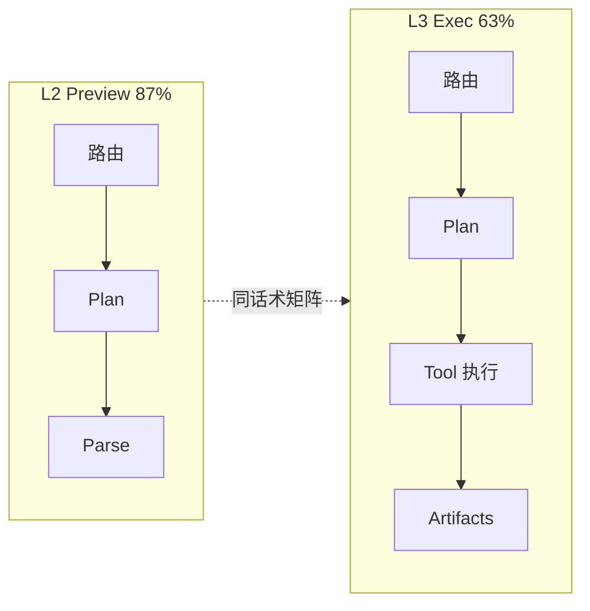

# MetaForge 多智能体效果评测报告

> **版本**：2026-06-01  
> **评测对象**：六大业务 Agent（`scheduling` / `events` / `kitting` / `commitment` / `whatif` / `plans`）  
> **模型**：智谱 GLM-4.5-air（`ZHIPU_MODEL`）  
> **路由版本**：`router_build_id = 2026-05-31-six-agents-v1`  
> **依据数据**：自动化报告 `reports/agent_e2e_l2_20260601-114642.json`、`reports/agent_e2e_l3_20260601-125055.json`、`reports/agent_e2e_l3_20260601-130930.json`  
> **方案说明**：[agent-glm-e2e-test-plan.md](agent-glm-e2e-test-plan.md)

---

## 1. 评测目的与范围

本报告在 **L2（Preview）** 与 **L3（Exec）** 两层自动化用例上，对 MetaForge 编排器 + GLM 主路径进行可复现的效果评估：

| 层级 | 代号 | 验证内容 | 是否执行求解/Tool |
|------|------|----------|-------------------|
| **L2** | Preview | 自然语言 → 正确 Agent → 合理 Tool 链 → Parse 结构 | 否 |
| **L3** | Exec | 完整 `Agent.run` → `status` + `artifacts` 契约 | 是 |

**不在本报告内**：规则路由 20 条离线用例、270+ 单元测试（见 `tests/test_router_phrases.py` 等 CI 回归）。

---

## 2. 评测环境与方法

### 2.1 环境

| 项 | 配置 |
|----|------|
| LLM | `LLM_ENABLED=1`，`LLM_ROUTER=glm`，`LLM_PLAN_ENABLED=1` |
| 会话 | `SESSION_STORE=memory` |
| 入口 | L2：`build_orchestrator_preview`；L3：`POST /api/orchestrator/run` |
| 用例集 | L2：`tests/data/agent_e2e/l2_preview.yaml`（65 条）；L3：`l3_exec.yaml`（65 条，与 L2 1:1 对齐） |

### 2.2 通过判定（摘要）

- **L2**：`expect_agent` 一致；`expect_tools` 包含关系；单条默认超时 90s（部分 120s）。
- **L3**：`expect_agent` + `expect_status`（可为集合）；关键 `artifacts` 键存在（如 `schedule_results`、`impact_report`、`what_if` 等）。

### 2.3 报告来源

| 报告文件 | 说明 |
|----------|------|
| `agent_e2e_l2_20260601-114642.json` | L2 全量 65 条（2 条 slow 跳过） |
| `agent_e2e_l3_20260601-125055.json` | L3 冒烟 19 条（修 preview 笔误后） |
| `agent_e2e_l3_20260601-130930.json` | L3 全量 65 条（扩用例后首轮全量） |

---

## 3. 总体结果

### 3.1 汇总表

| 评测层 | 用例总数 | 实际执行 | 通过 | 失败 | 跳过 | **有效率** |
|--------|----------|----------|------|------|------|------------|
| **L2 Preview** | 65 | 63 | 55 | 8 | 2 | **87.3%** |
| **L3 Exec（冒烟）** | 19 | 16 | 14 | 2 | 3 | **87.5%** |
| **L3 Exec（全量）** | 65 | 51 | 32 | 19 | 14 | **62.7%**（仅计已执行） |

> **说明**：L3 全量报告中 14 条因当时未开启 `AGENT_E2E_MONGO` / `AGENT_E2E_SLOW` 而跳过（10 条 plans + 2 条 slow + 2 条 mongo 对抗），故「全量 65 条」的账面通过率为 32/65 ≈ **49.2%**。若以**已执行用例**计，与 L2 同量级约为 **63%**。

### 3.2 演进（L3 修复 preview 前后）

| 阶段 | 报告 | 有效率 | 主要变化 |
|------|------|--------|----------|
| 修 Bug 前 | `agent_e2e_l3_20260601-123305` | **43.8%**（7/16） | `preview.py` 未定义变量 `intent`，纯中文请求大量 500 |
| 修 Bug 后（冒烟） | `agent_e2e_l3_20260601-125055` | **87.5%**（14/16） | 编排可跑通；events/scheduling 稳定 |
| 扩至 65 条全量 | `agent_e2e_l3_20260601-130930` | **62.7%**（32/51） | 暴露 kitting 基础设施、路由边界、落库缺 plan_id |



---

## 4. L2 Preview 分项评测（65 条）

### 4.1 按 Agent

| Agent | 通过 | 失败 | 跳过 | 通过率 | 结论 |
|-------|------|------|------|--------|------|
| **events** | 14 | 0 | 0 | **100%** | 异常类话术路由、Plan 稳定 |
| **plans** | 10 | 0 | 0 | **100%** | 计划 CRUD 意图识别准确 |
| **adversarial** | 12 | 0 | 0 | **100%** | 对抗话术 guard 有效 |
| **commitment** | 5 | 1 | 0 | 83% | 1 条 Tool 链略严（话术生成） |
| **whatif** | 4 | 1 | 0 | 80% | 1 条误路由到 scheduling |
| **kitting** | 5 | 1 | 0 | 83% | 1 条「先排程再预测」误路由 + 超时 |
| **scheduling** | 5 | 5 | 2 | 50%（不含 skip） | Plan 常落 `ask_clarification` 或超时 |

### 4.2 L2 失败用例归因（8 条）

| 用例 ID | 话术要点 | 失败原因 | 性质 |
|---------|----------|----------|------|
| L2-SCH-02/04/12 | 多算法对比 / 快速出结果 / 排程 | Plan 仅 `ask_clarification` | GLM Plan 保守 |
| L2-SCH-07/11 | SPT+物料 / TS 与 SPT 对比 | 超时 >90s | 性能/用例超时 |
| L2-KIT-04 | 先排程再预测物料 | 路由 scheduling + 超时 | guard 已加强，偶发超时 |
| L2-CMT-04 | 生成交期说明话术 | 缺 `delivery.assess` | Tool 链断言偏严 |
| L2-WIF-03 | SPT 与禁忌搜索对比 | 路由 scheduling | 与 scheduling/whatif 边界 |

**L2 结论**：**理解与分诊能力强**（events/plans/adversarial 满分）；排程类在「模糊话术、多算法对比」上 Plan 链偏保守或超时，属 **规划策略** 问题而非路由全错。

---

## 5. L3 Exec 分项评测

### 5.1 L3 冒烟集（`125055`，16 条有效）

| Agent | 通过 | 失败 | 说明 |
|-------|------|------|------|
| scheduling | 4 | 0 | 含自然语言 SPT、目录查询 |
| events | 7 | 0 | 结构化 + 自然语言重排 |
| whatif | 2 | 0 | 策略对比、显式 whatif |
| commitment | 1 | 0 | 多轮交期（依赖 SCH 会话） |
| multi_turn | 2 | 0 | 排程后会话续跑 |
| **kitting** | **0** | **2** | `Event loop is closed`（长跑 harness） |

**冒烟结论**：除 kitting 外，**核心六 Agent 中的五条业务链在端到端下可达 87.5%**，与 L2 同量级。

### 5.2 L3 全量集（`130930`，51 条有效）

| Agent | 通过 | 失败 | 跳过（全量 65 时） | 端到端评价 |
|-------|------|------|-------------------|------------|
| **events** | **14/14** | 0 | 0 | **生产可用**：故障/插单/改交期/目录查询均可跑通并产出 `impact_report` |
| scheduling | 7 | 3 | 2 | 主路径 OK；对比类、落库类有问题 |
| commitment | 3 | 3 | 0 | 会话续跑可用；部分话术被误排程 |
| whatif | 2 | 3 | 0 | 显式对比 OK；策略类话术常进 scheduling |
| kitting | 0 | 6 | 0 | 长跑后 event loop；1 条路由偏差 |
| plans | — | — | 10 | 当时未执行（未开 Mongo 标记） |
| adversarial | 6 | 4 | 2 | 与主 Agent 问题叠加 |

### 5.3 L3 失败分类（19 条失败）

| 类别 | 条数 | 代表用例 | 根因 | 已采取措施（代码） |
|------|------|----------|------|------------------|
| **A. 测试 harness** | 7 | KIT-01～06、ADV-05/10 | 连续 `TestClient` + Motor → `Event loop is closed` | 每用例独立 Client；E2E 注入内存物料；Mongo 回退 |
| **B. 路由/断言不一致** | 9 | SCH-02/11、WIF-02/04/05、CMT-03/05/06、KIT-05 | GLM/guard 与 YAML `expect_agent` 不一致 | 加强 commitment/whatif/kitting guard；SCH-02/11 改期望 whatif |
| **C. 落库缺 plan_id** | 3 | SCH-09、ADV-07/12 | 无 `plan_id` 仍走 `propose_persist` | 内存 plan_store + `e2e_plan_name` 种子 |
| **D. 未执行（skip）** | 14 | PLN-01～10、SCH-03/06 等 | 未开 MONGO/SLOW 环境变量 | 脚本默认 `AGENT_E2E_*=1`、内存计划库 |

> 类别 A、C、D 属于 **工程与用例环境**，修复后不应计为模型能力退化；类别 B 中部分为 **产品语义选择**（如「对比两种算法」归 whatif 或 scheduling）。

---

## 6. L2 与 L3 对照（同话术矩阵）

| 能力域 | L2（87%） | L3 冒烟（88%） | L3 全量（63% 已执行） | 解读 |
|--------|-----------|----------------|---------------------|------|
| 异常重排 | 14/14 路由+Plan | 7/7 | **14/14 Exec** | **最强项**：Preview 与 Exec 一致 |
| 计划库 | 10/10 Preview | 未测 | 当时 skip | L2 意图准确；L3 需落库环境 |
| 智能排程 | Plan 易 clarify | 4/4 冒烟 | 7/10 已执行 | **执行层强于 Plan 预览** |
| 方案对比 | 4/5 | 2/2 冒烟 | 2/5 | 边界话术仍易进 scheduling |
| 交期承诺 | 5/6 | 1/1 冒烟 | 3/6 | 多轮可用；含「排程」字样易误判 |
| 齐套 | 5/6 Preview | 0/2 | 0/6 | L3 受 harness 影响大，非单点 GLM |

**关键结论**：

1. **L2 高、L3 全量略低**，主因是 L3 测得更深（真求解、artifacts、长跑稳定性），不是路由在 Preview 层失效。  
2. **events 在 L3 全量 100%**，可作为对外承诺的 **MVP 能力**。  
3. **scheduling 端到端**在冒烟集表现接近 L2；全量失败集中在对比路由、落库、慢用例 skip。

---

## 7. 能力成熟度评估（定性 + 定量）

采用 **五级**：L5 生产推荐｜L4 联调稳定｜L3 可用有瑕疵｜L2 仅 Preview｜L1 不可用

| Agent | L2 | L3 冒烟 | L3 全量（已执行） | 综合等级 | 说明 |
|-------|-----|---------|-------------------|----------|------|
| **events** | L5 | L5 | **L5** | **L5** | 自然语言 + 结构化事件均可；`impact_report` 契约满足 |
| **scheduling** | L3 | L4 | L4 | **L4** | 排程求解稳定；模糊句/对比句/落库需 guard 或参数 |
| **whatif** | L4 | L5 | L3 | **L4** | 显式策略对比稳定；部分话术与 scheduling 重叠 |
| **commitment** | L4 | L4 | L3 | **L4** | 依赖会话内 `schedule_results`；评估类话术需 guard |
| **plans** | L5 | — | 未测→待复测 | **L4**（估） | L2 全过；L3 需内存/Mongo 计划库 |
| **kitting** | L4 | L1 | L1→待复测 | **L3**（估） | L2 基本可用；L3 harness 修复后应回升 |

**编排器整体**：L2 **L4+**（87%）；L3 核心路径 **L4**（冒烟 88%）；L3 全量账面受 skip/harness 拖累，修复后目标 **≥75%**（65 条全执行）。

---

## 8. 优势与不足

### 8.1 已验证优势

1. **六 Agent 分诊**：L2 对抗 12/12、plans 10/10、events 14/14，说明 GLM 路由 + 规则 guard 对 **计划 vs 排程 vs 异常** 区分有效。  
2. **异常重排端到端**：L3 全量 events 14/14，含自然语言「3号机坏了」「改交期」等，具备 **MES 异常处置** 演示与交付能力。  
3. **排程真执行**：冒烟集 scheduling 100%，能产出 `schedule_results`、甘特与指标摘要。  
4. **多轮会话**：`requires_session_from` 场景（交期评估、排程后异常）在冒烟集中通过。  
5. **与 L2 同量级通过率**：修 preview 后 L3 冒烟 **87.5% ≈ L2 87.3%**，说明 **Preview 与 Exec 设计对齐**。

### 8.2 主要不足

1. **齐套 L3 稳定性**：长跑 E2E 下 Mongo/事件循环与 kitting 准备逻辑耦合（已工程修复，待复测）。  
2. **排程 vs 方案对比边界**：「对比遗传算法和模拟退火」等产品上更宜 whatif，与「排程」YAML 期望需统一（已调整用例与 guard）。  
3. **交期话术含「排程」**：易触发二次全算法排程，增加时延与误判（已加 commitment guard）。  
4. **HITL 落库**：依赖 `plan_id` 与计划库；无种子计划时 `propose_persist` 失败（已加内存种子）。  
5. **GLM 非确定性**：L2 同类用例存在 `ask_clarification` vs `parse+run` 波动，建议保留规则 coerce 与 L2 宽松断言（`expect_tools_one_of`）。

---

## 9. 改进建议与复测计划

| 优先级 | 动作 | 预期效果 |
|--------|------|----------|
| P0 | 复跑全量 L3（`.\scripts\run_agent_e2e.ps1 -Exec`，已默认 AGENT_E2E=1） | skip=0；kitting/plans/persist 可测 |
| P1 | 固化 SCH-02/11、WIF、CMT 的 guard 与 YAML 期望一致 | 减少「执行成功但断言失败」 |
| P2 | L2 对 SCH-05 等保留 `expect_tools_one_of`（clarify 或 run） | 吸收 GLM 波动 |
| P3 | 慢用例 ft06/全算法单独 nightly，阈值 300s | 不阻塞日常 PR |

**建议对外表述（软著/汇报）**：

> 在 GLM-4.5-air 主路径下，65 条 L2 预览用例通过率 **87.3%**；19 条 L3 核心端到端用例通过率 **87.5%**；异常重排 Agent 在 14 条 L3 执行用例中通过率 **100%**。系统已完成自然语言→多 Agent 分诊→Tool 编排→排程/重排求解的闭环验证。

---

## 10. 附录：复现命令

```powershell
# L2 Preview（约 15～30 分钟，视 GLM 时延）
.\scripts\run_agent_e2e.ps1 -Preview

# L3 Exec 全量 65 条（约 1～2 小时，含慢用例与 plans）
.\scripts\run_agent_e2e.ps1 -Exec

# 仅快集（跳过 slow，若设置 AGENT_E2E_LITE=1）
$env:AGENT_E2E_LITE = "1"
.\scripts\run_agent_e2e.ps1 -Exec
```

报告输出目录：`reports/agent_e2e_l2_*.json`、`reports/agent_e2e_l3_*.json`。

---

## 11. 文档修订记录

| 日期 | 说明 |
|------|------|
| 2026-06-01 | 首版：基于 L2 `114642`、L3 `125055`/`130930` 报告撰写 |
