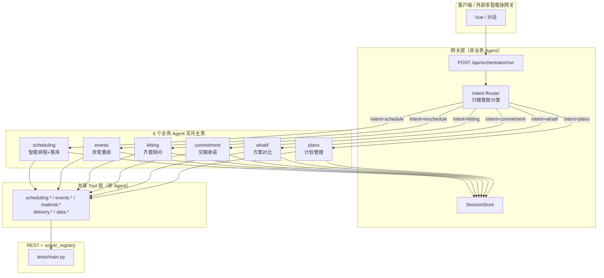
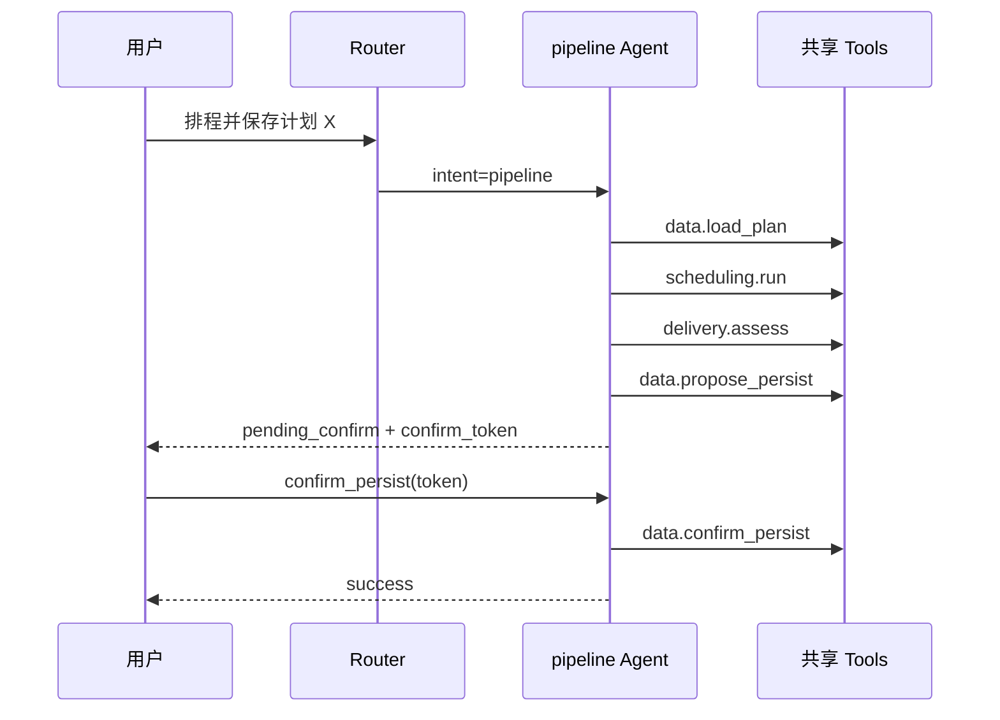

# MetaForge MES 多智能体与 Plan-and-Solve 设计说明

> **状态**：**历史设计稿**（2026-05-29）；部分章节未随 2026-05-31 改版全文修订。  
> **请以现行文档为准**：[`智能体功能清单.md`](../../智能体功能清单.md) · [`多智能体开发进度.md`](../../多智能体开发进度.md) · [`docs/README.md`](../../README.md)  
> **路线**：混合架构（服务端编排 + GLM 优先，规则护栏/回退）  
> **2026-05-31**：原场景 **E / `pipeline` Agent** 已合并入 **`scheduling`**（排程 + HITL 落库）；`intent=pipeline` 与 `/api/agents/pipeline/run` 为兼容别名。

---

## 1. 目标与原则

### 1.1 产品目标

在现有 FastAPI + MongoDB + Vue APS 之上，增加 **多智能体层**：**一个业务场景 = 一个 Agent = 一种用户意图**。多智能体的意义是 **按意图分流到专责 Agent**，而不是由一个总 Planner 把用户请求拆给多个「横切」Agent。

### 1.2 场景 ↔ Agent 一一对应（核心表）

| 场景 | Agent ID | 中文名 | 用户意图 `intent` | 一句话职责 |
|------|----------|--------|-------------------|--------------|
| **排程** | `scheduling` | 智能排程 Agent | `schedule` | 自然语言/参数 → 匹配算法与策略 → 执行排程并返回甘特与指标 |
| **A** 异常与重排 | `events` | 异常重排 Agent | `reschedule` | 识别动态事件 → 重调度 → 输出影响报告与承诺变化 |
| **B** 齐套顾问 | `kitting` | 齐套顾问 Agent | `kitting` | 开工前齐套预测、排程后物料仿真、齐套约束下的排程建议 |
| **C** 交期承诺 | `commitment` | 交期承诺 Agent | `commitment` | 判断计划是否满足客户交期，生成风险说明与对外话术 |
| **D** 方案对比 | `whatif` | 方案对比 Agent | `whatif` | 多方案/多参数对比，Reflect 后给出推荐 |
| **F** 计划管理 | `plans` | 计划管理 Agent | `plans` | 计划库 CRUD、绑定、跳转 APS |
| ~~**E** 计划流水线~~ | ~~`pipeline`~~ | — | — | **已合并入 `scheduling`**：落库话术 / `persist_after` → HITL |

> **说明**：此前文档把 `SchedulingAgent`、`AnalystAgent` 当作「横切能力」，由总 Planner 串联，容易造成「一个场景多个 Agent」的误解。  
> **修订后**：用户请求先 **Router 选一个主责 Agent**；Plan-and-Solve 发生在 **该 Agent 内部**；其他能力以 **共享 Tool** 形式被调用（见 §2.3），不再作为并列业务 Agent 出现在同一次编排里。

### 1.3 工程原则（已确认）

1. **场景 A 事件类型**：采用 **扩展版**（含已实现 + 规划事件，统一契约）。
2. **排程落库（原场景 E）**：**Human-in-the-Loop（HITL）** — 由 **`scheduling` Agent**（或编排器后置）发起 `propose_persist`，用户确认后才写库。
3. **分阶段智能化**：
   - **Phase 0–2**：各 Agent 内 **规则 Plan** + 完整 **Tool**（schema、单测）。
   - **Phase 3+**：各 Agent 内接入 LLM 解析 NL / 生成 Plan，**Tool 接口不变**。
4. **算法不拆 Agent**：14 种求解器仍在 `solver_registry`，由 **`scheduling.*` Tool** 统一调用，不设「TabuAgent」「GAAgent」等。

---

## 2. 总体架构

### 2.1 路由：一个意图 → 一个主责 Agent



**Router 不是业务 Agent**：它只做 `intent` 识别（规则或 LLM 分类），然后把请求 **整包** 交给上表中的一个 Agent。  
**禁止**：一次用户请求在 Gateway 层串行调度多个业务 Agent（例如「先 events 再 commitment」应用户分别发两次，或由 **whatif / scheduling** 在自己的 Plan 里调多个 Tool）。

### 2.2 每个 Agent 的内部结构（统一模板）

```text
Agent.run(request)
  ├─ parse_input()          # 规则 / 后期 LLM：产出结构化 params
  ├─ build_plan()           # Plan-and-Solve：本 Agent 专属步骤模板
  ├─ execute_plan()         # 顺序/分支执行，只调本 Agent 允许的 Tool 列表
  ├─ reflect()              # 失败重规划（仍在本 Agent 内）
  └─ finalize()             # summary_zh + artifacts
```

### 2.3 Agent 与 Tool 的关系（为何不是 1 Agent = 1 Tool 目录）

| 概念 | 含义 |
|------|------|
| **Agent** | 面向用户的 **意图域**，拥有专属 Plan、NL 关键词、对外 API |
| **Tool** | 无状态原子能力，可被多个 Agent **复用** |

示例：

- `kitting` Agent 的 Plan 可依次调用 `material.check_static` → `scheduling.run` → `material.predict`（三个 Tool，**一个** Agent）。
- `commitment` Agent 只调用 `delivery.assess` / `delivery.customer_script`，**不**再设 AnalystAgent。
- `scheduling` Agent 只调用 `scheduling.parse_intent` + `scheduling.run`，不涉及齐套、落库。

**共享 Tool 一览**（实现时按目录划分，不对应业务 Agent 数量）：

| Tool 前缀 | 主要调用方 Agent |
|-----------|------------------|
| `scheduling.*` | scheduling, kitting, whatif |
| `events.*` | events, whatif |
| `material.*` | kitting |
| `delivery.*` | commitment, events, scheduling |
| `data.*` | scheduling, plans |
| `compare.*` | whatif |

### 2.4 三层职责

| 层 | 职责 | Phase 0–2 | Phase 3+ |
|----|------|-----------|----------|
| **Tool** | 原子能力，强类型入参/出参，可单测 | 全部实现 | 不变 |
| **Agent（6 个）** | 单意图域内的 Plan-and-Solve + NL 解析 | 规则 | +LLM |
| **Router** | `message`/`intent` → 选一个 Agent | 规则 | +LLM 分类 |

### 2.5 统一会话与响应

**请求** `POST /api/orchestrator/run`（或分 Agent：`POST /api/agents/{agent_id}/run`）：

```json
{
  "message": "可选，Phase 3 启用",
  "intent": "schedule | kitting | reschedule | commitment | whatif | plans",
  "context": {
    "session_id": "可选",
    "plan_id": "可选",
    "custom_data": [],
    "benchmark_file": null,
    "confirm_token": null
  },
  "params": "可选，结构化参数，跳过 NL 解析"
}
```

**`intent` 与 `agent_id` 固定映射**（禁止歧义）：

| intent | agent_id |
|--------|----------|
| `schedule` | `scheduling` |
| `reschedule` | `events` |
| `kitting` | `kitting` |
| `commitment` | `commitment` |
| `whatif` | `whatif` |
| `plans` | `plans` |
| ~~`pipeline`~~ | ~~`scheduling`~~（兼容别名） |

**响应**：

```json
{
  "status": "success | need_input | pending_confirm | failed",
  "session_id": "uuid",
  "plan": [
    {
      "step_id": "s1",
      "agent": "material",
      "action": "check_static",
      "status": "completed",
      "duration_ms": 12
    }
  ],
  "summary_zh": "给用户的一段话",
  "artifacts": {},
  "pending_action": null
}
```

`pending_action` 由 **`scheduling` Agent**（排程落库）或编排器产生（HITL）：

```json
{
  "type": "confirm_persist",
  "confirm_token": "signed-uuid",
  "expires_at": "ISO8601",
  "preview": { "plan_id": "...", "best_solver": "ts", "makespan": 120.5, "high_risk_jobs": [] }
}
```

---

## 3. 六个业务 Agent 职责说明书

> 对外注册：`GET /api/agents/registry`（待建），每项与下表一致。  
> 现有 `SchedulingAgent`（`src/metaforge/agent/scheduling_agent.py`）演进为 **`scheduling` Agent** 实现，不删除，而是对齐下表接口。

### 3.0 `scheduling` — 智能排程 Agent

| 项 | 内容 |
|----|------|
| **场景** | 用户明确要「排程 / 选算法 / 调策略」，不涉及异常、齐套流水线、落库 |
| **意图** | `schedule` |
| **职责** | 解析算法与策略权重 → 调用排程引擎 → 返回 `data`（多算法对比可选） |
| **不负责** | 齐套预审、异常重排、交期话术、写库、多方案 Reflect |
| **允许 Tool** | `scheduling.parse_intent`, `scheduling.run`, `scheduling.run_async` |
| **内部 Plan 模板** | `[parse_intent → run]`；若用户说「对比」则 `run` 传多 solver |
| **NL 触发词** | 排程、算法、禁忌、遗传、交付优先、吞吐、ft06、对比算法 |
| **API** | `POST /api/agents/scheduling/run`（现有 `/api/agent/schedule` 可别名保留） |
| **产出 artifacts** | `schedule_results`, `interpretation` |

---

### 3.1 `events` — 异常重排 Agent（场景 A）

| 项 | 内容 |
|----|------|
| **场景** | 动态事件后的重调度与影响评估 |
| **意图** | `reschedule` |
| **职责** | 识别事件类型与参数 → 重排 → 输出 `impact_report` + 交期变化摘要 |
| **不负责** | 日常首次排程、齐套、落库 |
| **允许 Tool** | `events.parse_event`, `events.reschedule`, `delivery.assess`, `delivery.explain_impact` |
| **内部 Plan** | `[parse_event → reschedule → explain_impact]` |
| **NL 触发词** | 插单、坏了、停机、改交期、重排、故障、加急插入 |
| **API** | `POST /api/agents/events/run` |
| **产出 artifacts** | `event_envelope`, `impact_report`, `schedule_results`, `commitment_changes` |

---

### 3.2 `kitting` — 齐套顾问 Agent（场景 B）

| 项 | 内容 |
|----|------|
| **场景** | 开工前齐套 + 可选排程 + 排程后物料仿真 |
| **意图** | `kitting` |
| **职责** | 静态齐套、就绪延迟建议、enforce 排程、消耗预测、给出「能否开工」结论 |
| **不负责** | 设备故障、交期对外话术、写库 |
| **允许 Tool** | `material.check_static`, `material.compute_delays`, `material.predict`, `scheduling.run`, `kitting.build_report` |
| **内部 Plan** | 见 §5.3（能否开工 / 齐套后排程 / 先排后看风险） |
| **NL 触发词** | 齐套、缺料、BOM、库存、能否开工、物料约束 |
| **API** | `POST /api/agents/kitting/run` |
| **产出 artifacts** | `kitting_report`, `material_check`, `schedule_results?`, `material_predict?` |

---

### 3.3 `commitment` — 交期承诺 Agent（场景 C）

| 项 | 内容 |
|----|------|
| **场景** | 当前计划是否满足客户交期；对外怎么说 |
| **意图** | `commitment` |
| **职责** | 基于已有或本次计算的甘特，生成逐单风险与总体结论、客户话术 |
| **不负责** | 发起重排（除非 `params` 要求先 `scheduling.run`，仍在本 Agent Plan 内调 Tool） |
| **允许 Tool** | `delivery.assess`, `delivery.customer_script`, `scheduling.run`（仅当无结果时） |
| **内部 Plan** | `[resolve_schedule_ref → assess → customer_script?]` |
| **NL 触发词** | 交期能不能保、会延期吗、跟客户怎么说、承诺、风险 |
| **API** | `POST /api/agents/commitment/run` |
| **产出 artifacts** | `delivery_assessment`, `customer_script` |

---

### 3.4 `whatif` — 方案对比 Agent（场景 D）

| 项 | 内容 |
|----|------|
| **场景** | 多策略 / 多约束 / 多事件参数对比 |
| **意图** | `whatif` |
| **职责** | 展开 variants → 多次 Solve → 对比 → Reflect → 推荐 |
| **不负责** | 单次普通排程（应走 `scheduling`） |
| **允许 Tool** | `scheduling.run`, `events.reschedule`, `compare.variants`, `delivery.assess` |
| **内部 Plan** | `[build_variants → for each run → compare → reflect]` |
| **NL 触发词** | 对比、假设、如果、哪种更好、两种方案 |
| **API** | `POST /api/agents/whatif/run` |
| **产出 artifacts** | `what_if`, `recommendation` |

---

### 3.5 ~~`pipeline`~~ — 已合并入 `scheduling`（原场景 E）

> 现行行为见 [智能体功能清单.md](../../智能体功能清单.md) §1「排程落库」。下文保留历史描述。

### 3.5（历史）`pipeline` — 计划流水线 Agent

| 项 | 内容 |
|----|------|
| **场景** | 从数据库加载计划 → 排程 → 评估 → **HITL** 落库 |
| **意图** | `pipeline` |
| **职责** | `load_plan` → 排程 → 交期评估 → `propose_persist` → 等待确认 → `persist_result` |
| **不负责** | 无 plan_id 的纯排程（应走 `scheduling`） |
| **允许 Tool** | `data.load_plan`, `scheduling.run`, `delivery.assess`, `data.propose_persist`, `data.confirm_persist` |
| **内部 Plan** | 见 §7.1 |
| **NL 触发词** | 保存、加载计划、数据中心、落库、写入方案 |
| **API** | `POST /api/agents/pipeline/run` |
| **产出 artifacts** | `schedule_results`, `delivery_assessment`, `pending_action` |

---

### 3.6 意图冲突时的路由优先级（Router 规则）

1. 含「保存/落库」且含 `plan_id` → `pipeline`  
2. 含「对比/假设/如果」且含 ≥2 种策略或约束 → `whatif`  
3. 含「插单/故障/改交期/重排」→ `events`  
4. 含「齐套/缺料/能否开工」→ `kitting`  
5. 含「交期/承诺/客户」且 **无** 排程动作 → `commitment`  
6. 其余含排程/算法 → `scheduling`  

---

## 4. 场景 A：`events` Agent — 异常响应与重排（扩展事件）

### 3.1 事件类型注册表

| event_type | 状态 | 说明 | Tool / API |
|------------|------|------|------------|
| `insert_order` | **已实现** | 插单，`local_repair` / `global` | `tools/events/insert_order_reschedule` → `POST /api/events/insert_order_reschedule` |
| `machine_breakdown` | **已实现** | 设备故障窗口 | `POST /api/events/machine_breakdown_reschedule` |
| `due_date_change` | **已实现** | 批量改工单交期 | `POST /api/events/due_date_reschedule` |
| `planned_downtime` | **待实现** | 计划性停机 | `PUT /api/resources/config`（`downtime_blocks`）+ `scheduling.run` |
| `material_delay` | **待实现** | 物料晚到 N 小时 | 写 `JobData.material_arrival` 或批量 API + 重排 |
| `priority_change` | **待实现** | 调整 `priority` | 更新 jobs + 重排 |
| `order_cancel` | **待实现** | 撤单/暂停 | 从 `base_jobs` 移除 + 重排 |
| `quantity_change` | **待实现** | 工单数量变更 → duration/BOM | 更新 jobs + 重排 |

**统一事件信封**（所有类型共用，便于 Agent/Tool）：

```json
{
  "event_type": "machine_breakdown",
  "base_jobs": [],
  "base_plan_id": "可选",
  "freeze_time": 0.0,
  "params": {},
  "reschedule_options": {
    "solvers": ["ts", "spt"],
    "weights": {},
    "mode": "local_repair",
    "random_seed": null
  }
}
```

各类型 `params` 示例：

| event_type | params 字段 |
|------------|-------------|
| `insert_order` | `insert_job: JobData`, `mode: local_repair \| global` |
| `machine_breakdown` | `machine_id`, `breakdown_start`, `breakdown_duration` |
| `due_date_change` | `due_date_changes: [{ job_name, new_due_date }]` |
| `planned_downtime` | `downtime_blocks: [{ machine_id, start, end, label }]` |
| `material_delay` | `job_name`, `delay_hours` 或 `material_arrival` |
| `priority_change` | `changes: [{ job_name, new_priority }]` |
| `order_cancel` | `job_names: []` |
| `quantity_change` | `changes: [{ job_name, new_quantity }]` |

### 3.2 重排结果契约（必须齐全）

每次 `reschedule` Tool 成功返回：

```json
{
  "status": "success",
  "event_type": "...",
  "results": { "ts": { "gantt_data", "metrics", "score", ... } },
  "best_solver": "ts",
  "impact_report": {
    "baseline_solver": "spt",
    "rescheduled_solver": "ts",
    "affected_jobs": 3,
    "max_delay": 4.5,
    "delay_details": [],
    "commitment_changes": [],
    "freeze_time": 0,
    "mode": "local_repair"
  },
  "delivery_predictions_before": [],
  "delivery_predictions_after": []
}
```

**验收**：`impact_report` + 前后 `delivery_predictions` + 至少一套可渲染甘特数据。

### 4.3 `events` Agent 内 Plan 模板

| action | 输入 | 输出 |
|--------|------|------|
| `parse_event` | `message` 或 `event_envelope` | `event_envelope` + `clarifications[]` |
| `reschedule` | `event_envelope` | 上一节完整结果 |
| `list_event_types` | — | 注册表元数据（供 UI/LLM） |

**典型 Plan（设备故障）**：

1. `data.load_plan`（若有 plan_id）  
2. `events.parse_event`  
3. `events.reschedule`  
4. `delivery.explain_impact`  

**Reflect**：

- 缺 `base_jobs` → `need_input`  
- `parse_event` 置信度低 → 返回澄清问题，不执行 reschedule  
- reschedule 失败 → 尝试 `mode=global` 或缩减 solvers（规则 Reflect，Phase 3 可 LLM Reflect）

---

## 5. 场景 B：`kitting` Agent — 齐套驱动排程顾问

### 4.1 齐套检查维度

| 维度 | 字段/逻辑 | Tool |
|------|-----------|------|
| BOM 行 | `material_id`, `quantity_per_unit`, `consume_mode` | `job_bom_demand` |
| 消耗模式 | `job_start` / `per_hour` | `material_constraints` |
| 库存 | `current_stock`, `safe_level` | Mongo materials |
| 静态齐套 | 每单 `feasible`，全局 `summary` | `material.check_static` |
| 就绪延迟 | `material_arrival` 推算 | `material.compute_arrival_delays` |
| 排程后仿真 | 时间轴库存曲线 | `material.predict` |
| 求解约束 | `enforce_material` | `scheduling.run` |

### 5.2 `kitting` Agent 调用的 Tool（无独立 MaterialAgent）

| Tool 名 | 绑定 API |
|---------|----------|
| `material.check_static` | `POST /api/materials/check_jobs` |
| `material.compute_delays` | 内部 `compute_material_arrival_delays` |
| `material.predict` | `POST /api/materials/predict` |
| `scheduling.run` | `POST /api/run` |
| `kitting.build_report` | 聚合静态+仿真为 `kitting_report` |

**开工前预测输出** `kitting_report`：

```json
{
  "can_start_all": false,
  "static_check": { "feasible", "per_job", "summary" },
  "blocking_jobs": [{ "job_name", "shortages": [] }],
  "recommendation_zh": "建议推迟工单 B 或补货 MAT_SCREW 200 件"
}
```

### 5.3 典型 Plan（均在 `kitting` Agent 内执行）

| 意图 | Steps |
|------|-------|
| 能否开工 | `material.check_static` → `kitting.build_report` |
| 齐套后排程 | `check_static` → `scheduling.run(enforce=true)` → `predict_after_schedule` |
| 先排再看风险 | `scheduling.run(enforce=false)` → `predict_after_schedule` → 标红缺料时段 |

---

## 6. 场景 C：`commitment` Agent — 交期承诺与解读

### 5.1 风险等级与业务结论

| risk_level | 对客户结论 |
|------------|------------|
| `on_time` / `low` | **可满足** |
| `medium` | **勉强可满足，需跟踪** |
| `high` / `critical` | **当前计划无法满足** |
| `unknown` | 未设交期，仅报预测完工时间 |

数据来源：`compute_delivery_predictions`（`/api/run` 与各 events API 已带）。

### 6.2 `commitment` Agent 调用的 Tool

| Tool 名 | 说明 |
|---------|------|
| `delivery.assess` | 逐单风险与 `overall` 结论 |
| `delivery.customer_script` | 对外话术 |
| `scheduling.run` | 仅当 session 无甘特时先算一版 |

> `delivery.explain_impact` 归属 **`events` Agent**（解读重排影响）；`compare.variants` 归属 **`whatif` Agent**。

**输出** `delivery_assessment`：

```json
{
  "overall": "partially_met",
  "counts": { "on_time": 5, "high": 2 },
  "jobs": [{ "job_name", "risk_level", "tardiness", "verdict_zh" }],
  "summary_zh": "..."
}
```

---

## 7. 场景 D：`whatif` Agent — 方案对比

### 6.1 对比轴（variant 定义）

```json
{
  "variant_id": "v1",
  "label": "交付优先 + 齐套",
  "scheduling": { "strategy_id": "delivery", "enforce_material": true, "solvers": ["ts"] },
  "event": null
}
```

支持组合：策略权重、enforce、算法集、重排 mode、故障时长等。

### 6.2 Plan 模式

1. Planner 展开 `variants[]`（确定性：用户显式传；后期 LLM 生成）  
2. 对每个 variant 执行 `scheduling.run` 或 `events.reschedule`  
3. `compare.variants` → `recommendation` + `recommendation_reason_zh`  

**Reflect**：若 variants 结果差异 < 阈值（如 makespan 差 <1%），提示「方案差异不显著」。

---

## 8. 场景 E：`pipeline` Agent — 计划→排程→落库（Human-in-the-Loop）

### 8.1 流程（单 Agent 内 Plan-and-Solve）



### 8.2 HITL 规则

| 规则 | 说明 |
|------|------|
| 默认不自动写库 | `persist_result` 必须带有效 `confirm_token` |
| Token 一次性 | 确认后失效；15 分钟过期 |
| Preview 必含 | 计划名、最优算法、makespan、高风险工单列表、甘特缩略指标 |
| 拒绝确认 | 用户取消 → session 保留 artifacts，可改参重跑 |
| 审计字段 | `persisted_by`（用户 id，若后续有登录）、`persisted_at` |

### 8.3 `pipeline` Agent 调用的 Tool（须新增/封装 API）

| action | 说明 | 预备 API |
|--------|------|----------|
| `load_plan` | 读 `work_orders.jobs` | 现有 find_one |
| `list_plans` | 最近 N 条 | `GET /api/db/list` |
| `propose_persist` | 生成 token + preview | **`POST /api/db/propose_save`**（待建） |
| `persist_result` | 确认后写入 | **`POST /api/db/confirm_save`**（待建） |
| `update_status` | pending/done | 现有 `POST /api/db/status/{oid}` |

**`propose_save` 写入内容（preview）**：

- `schedule_result`：最佳 solver 的完整结果 JSON  
- `chart_image`：可选，Phase 2  
- `interpretation`：Analyst 摘要  

---

## 9. Tool 层规范（当前开发重点）

### 9.1 目录结构（建议）

```
src/metaforge/
  tools/
    __init__.py
    base.py              # ToolResult, ToolError, schema 导出
    scheduling/
      run.py
      run_async.py
      parse_intent.py    # 封装 SchedulingAgent.parse
    events/
      reschedule.py
      parse_event.py
      registry.py        # EVENT_REGISTRY 扩展事件
    material/
      check_static.py
      predict.py
    delivery/
      assess.py
      customer_script.py
      explain_impact.py
    compare/
      variants.py
    data/
      load_plan.py
      propose_persist.py
      confirm_persist.py
  orchestrator/
    planner_rules.py
    router.py
    session.py
  agents/
    base.py
    scheduling.py   # 迁移 scheduling_agent.py
    events.py
    kitting.py
    commitment.py
    whatif.py
    pipeline.py
```

### 9.2 Tool 接口约定

每个 Tool：

```python
@dataclass
class ToolSpec:
    name: str                    # e.g. "events.reschedule"
    description_zh: str
    input_schema: dict           # JSON Schema
    output_schema: dict
    handler: Callable[..., ToolResult]

@dataclass
class ToolResult:
    ok: bool
    data: dict
    error: Optional[str] = None
    artifacts_key: Optional[str] = None  # 写入 session.artifacts
```

- **必须有**：入参 pydantic 模型、出参 pydantic 模型、单测、OpenAPI 可导出 schema。  
- **禁止**：Tool 内直接读自然语言（NL 只在 Agent/Planner 层，Phase 3 才接 LLM）。

### 9.3 Tool 注册表（供各 Agent 与后期 LLM function calling）

`GET /api/tools/registry`（待建）返回全部 Tool 的 `name + input_schema + description_zh`。

与现有：

- `GET /api/solvers/catalog`
- `GET /api/agent/info`
- `GET /api/objectives/schema`

并列，作为「机器可读能力说明书」。

---

## 10. Agent 注册表 API（与场景 1:1）

`GET /api/agents/registry` 返回 6 条记录，结构示例：

```json
{
  "agents": [
    {
      "id": "scheduling",
      "name_zh": "智能排程 Agent",
      "intent": "schedule",
      "scenario": "排程",
      "endpoint": "/api/agents/scheduling/run",
      "allowed_tools": ["scheduling.parse_intent", "scheduling.run", "scheduling.run_async"],
      "nl_keywords": ["排程", "算法", "禁忌搜索", "遗传"]
    }
  ]
}
```

**不再注册** `material`、`analyst`、`data` 为独立业务 Agent（已收敛为 Tool + 上表 6 Agent）。

---

## 11. Plan-and-Solve：在 Agent 内部，不在 Gateway 串联

### 11.1 规则版（Phase 0–2）

- **Router**：只选 Agent，不生成跨 Agent 的 Plan。  
- **各 Agent**：`build_plan()` 使用本章 §3、§4–8 的固定模板。  
- 可 100% 单测：`agent_id + params → plan steps → artifacts`。

### 11.2 LLM 版（Phase 3+，按 Agent 启用）

- 每个 Agent 独立配置是否启用 LLM Plan（例如先 `scheduling`、`events`）。  
- LLM 输出必须符合 **该 Agent 的 `allowed_tools` 白名单**。  
- 校验失败 → 回退该 Agent 的规则 Plan。

### 11.3 PlanStep schema（Agent 内部步骤）

```json
{
  "step_id": "s1",
  "agent": "material",
  "action": "check_static",
  "params": { "jobs_ref": "context.custom_data" },
  "on_failure": "abort | skip | replan",
  "optional": false
}
```

`params` 支持引用：`context.*`、`artifacts.<key>.*`、上一步 `steps[s0].output`。

---

## 12. MCP 外部工具（Phase 5，可选）

| 用途 | MCP 示例 | 说明 |
|------|----------|------|
| 读 ERP 订单 | 自定义 MCP | 转为 `custom_data` 后走 Tool |
| 读 Excel 工单 | filesystem MCP | 仅开发/导入 |
| 钉钉/邮件通知 | 通知 MCP | 排程完成后发送，失败不影响核心 |
| 排程/重排/齐套 | **不用 MCP** | 内建 REST Tool |

MCP 适配器：`orchestrator/mcp_adapter.py`，将 MCP tool 映射为与内建 Tool 相同的 `ToolResult`。

---

## 13. 实施路线图

### Phase 0：Tool 基础（2–3 周）

- [ ] `metaforge/tools/base.py` + `ToolResult`  
- [ ] 封装已有 API：`scheduling.run`、`material.check_static`、`material.predict`  
- [ ] `GET /api/tools/registry`  
- [ ] 每个 Tool 单测 + schema 快照  

### Phase 1：6 Agent 骨架 + scheduling / commitment（1–2 周）

- [ ] `agents/base.py` + `Agent.run()` 模板  
- [ ] `scheduling` Agent 对齐现有 `SchedulingAgent`  
- [ ] `commitment` Agent + `delivery.*` Tool  
- [ ] Router：`intent` → 单 Agent  
- [ ] `GET /api/agents/registry`  

### Phase 2：`kitting` + `events`（2–3 周）

- [ ] `kitting` Agent + `material.*` Tool  
- [ ] `events` Agent + 扩展事件 API  
- [ ] `impact_report` 契约测试  

### Phase 3：`whatif` + `pipeline` HITL（1–2 周）

- [ ] `whatif` Agent + `compare.variants`  
- [ ] `pipeline` Agent + `propose_save` / `confirm_save`  
- [ ] 前端 HITL 确认卡片  

### Phase 4：编排与 E2E（1 周）

- [ ] `POST /api/orchestrator/run` 或 6 个分 Agent 端点统一  
- [ ] `tests/test_agents_*.py` 每 Agent 至少 1 条 E2E  

### Phase 5：LLM 接入（按需）

- [ ] Planner LLM 适配器（OpenAI 兼容 / 本地）  
- [ ] `message` 自然语言入口；Tool schema 作 function calling  
- [ ] 评估集：20 条车间话术 → Plan 准确率  

### Phase 6：MCP（可选）

- [ ] ERP/通知 MCP 白名单  
- [ ] 生产默认 `MCP_ENABLED=false`  

---

## 14. 与现有代码映射

| 已有 | 设计中的角色 |
|------|----------------|
| `SchedulingAgent` + `/api/agent/schedule` | **`scheduling` Agent** 实现体；Tool 为 `scheduling.*` |
| `solver_registry` | 仅 `scheduling.run` Tool 使用 |
| `STRATEGY_TEMPLATES` | `scheduling` / `whatif` 解析策略 |
| `/api/events/*` | **`events` Agent** 底层 Tool |
| `material_constraints.py` | **`kitting` Agent** 底层 Tool |
| `delivery_prediction.py` | **`commitment` / `events` / `pipeline`** 的 `delivery.*` Tool |
| `/api/db/*` | **`pipeline` Agent** 的 `data.*` Tool + HITL 新接口 |

---

## 15. 测试策略

| 层级 | 内容 |
|------|------|
| Tool 单测 | 每个 handler _mock REST 或直接调函数 |
| 契约测 | `impact_report`、`kitting_report`、`delivery_assessment` JSON schema |
| Agent 测 | 每个 `agent_id` 固定 `params` → 预期内部 `plan` 与 `artifacts` |
| Router 测 | `message` → 唯一 `agent_id` |
| HITL 测 | `propose` → 无 token 拒绝 `persist` → 有效 token 成功 |
| 回归 | 现有 `test_api_smoke.py`、`test_material_bom.py` 保持绿 |

---

## 16. 非目标（本期不做）

- 权限与操作审计（改进计划 P5-D 仍暂缓）  
- 14 个算法各一个 Agent  
- Gateway 层一次请求调度多个业务 Agent  
- 独立 `MaterialAgent` / `AnalystAgent` / `DataAgent` 对外暴露  
- HFSP 流水车间  
- 生产环境默认开启 MCP  

---

## 17. 决策记录

| 日期 | 决策 |
|------|------|
| 2026-05-29 | 架构路线：混合（服务端编排 + 可选 MCP） |
| 2026-05-29 | 场景 A：扩展事件类型（含待实现 API） |
| 2026-05-29 | 场景 E：Human-in-the-Loop 落库 |
| 2026-05-29 | 实施顺序：Tool 完备 → 规则编排 → LLM |
| 2026-05-29 rev.2 | **场景与业务 Agent 1:1**；6 Agent + 共享 Tool；Router 不串多 Agent |

---

## 18. 评审后下一步

1. 评审本文档并确认 Phase 0 范围。  
2. 使用 **writing-plans** 生成 `2026-05-29-mes-multi-agent-implementation-plan.md`（任务拆解到文件级）。  
3. 从 `tools/scheduling` + `tools/material` 开始编码，**不先接 LLM**。

---

*文档结束*
