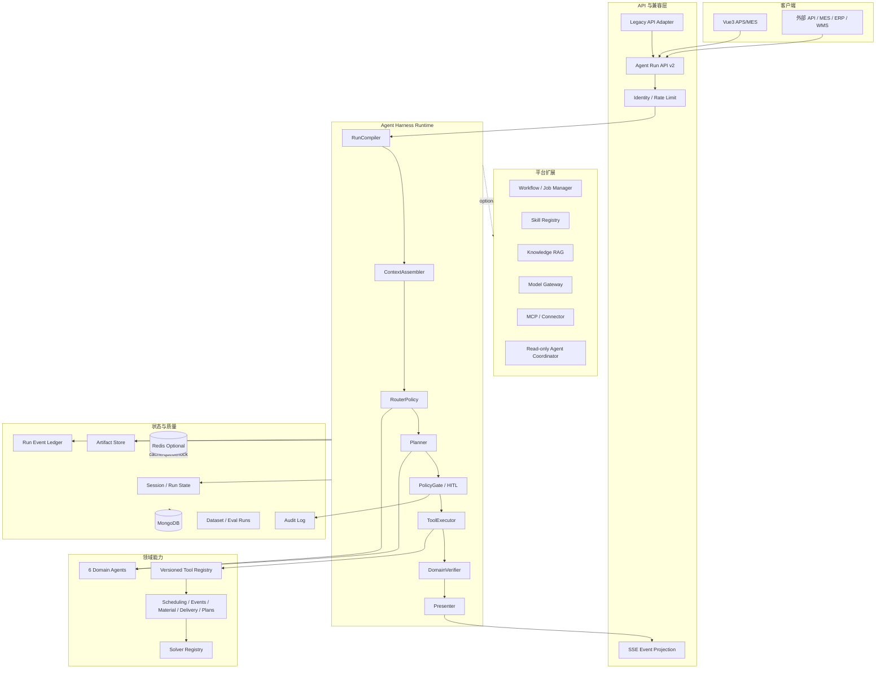
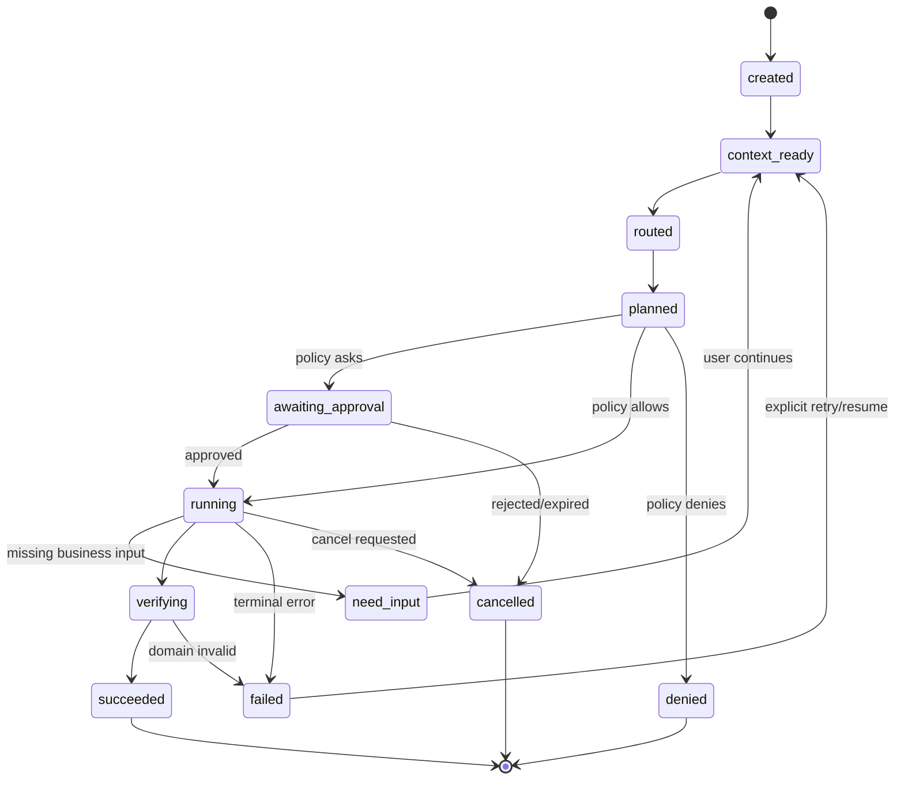
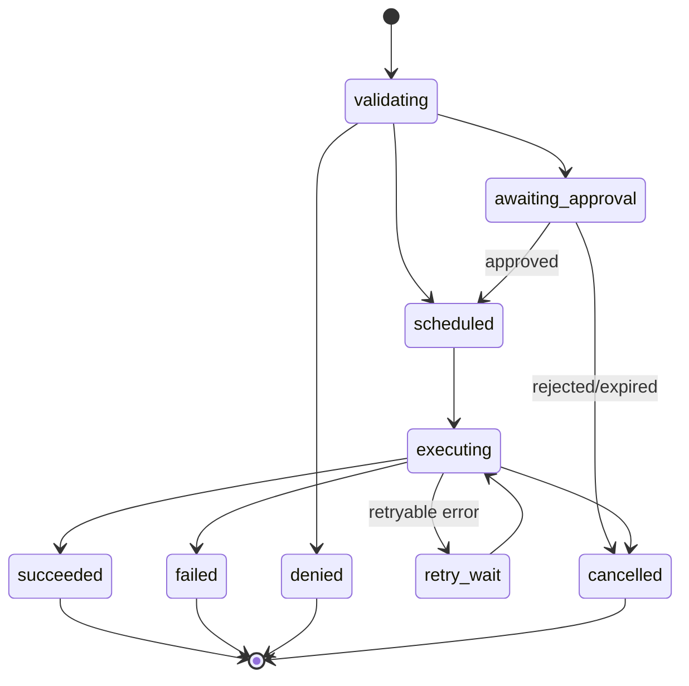

# MetaForge Agent Harness 与平台化改造设计规范（B+C 组合方案）

> 日期：2026-07-31  
> 状态：待审查设计稿；本文件只定义目标架构与迁移边界，不代表代码已实现  
> 适用范围：MetaForge APS/MES、六大领域 Agent、Tool、LLM、会话、评测、前端智能助手及外部系统接入  
> 设计路线：**B 增量式 Harness 化作为强制主干，C 平台能力作为按指标启用的扩展层**  
> 现行业务基线：[`../../PRD.md`](../../PRD.md)、[`../../智能体功能清单.md`](../../智能体功能清单.md)、[`../../多智能体开发进度.md`](../../多智能体开发进度.md)  
> 教程参考：[`../../../Practical-Guide-to-Context-Engineering/README.md`](../../../Practical-Guide-to-Context-Engineering/README.md)

---

## 1. 执行摘要

MetaForge 已经具备正确的领域内核：六个互斥主责 Agent、约 30 个领域 Tool、14 类求解器、MongoDB 业务状态、SSE 过程展示，以及排程覆盖时的 HITL 确认。当前主要问题不是“智能体数量不够”，而是这些能力缺少一套统一、可验证、可治理、可扩展的运行底座。

本设计不重写求解器，不拆散六大业务域，也不把系统立即改造成微服务。目标是在现有模块化单体上建立统一的 `AgentRuntime`：一次请求只编译一次路由、上下文和计划；所有 Tool 经过统一契约、权限、执行、验证与审计；所有状态由唯一事实源管理；所有运行过程可追踪、可恢复、可回放、可评测。

在此基础上，逐步提供平台化扩展点：持久化工作流、受信 Skill、知识 RAG、模型网关、MCP 外部连接、Redis 缓存与多 Worker、多 Agent 并行研究。这些扩展默认关闭，只有满足本规范规定的启用门槛时才引入。

### 1.1 最终结论

| 决策项 | 设计结论 |
|---|---|
| 总体形态 | 模块化单体优先，保留未来拆分 Worker/服务的接口 |
| Agent 形态 | 保留六个互斥主责领域 Agent；默认一次请求一个主责 Agent |
| LLM 职责 | 理解、路由、规划、解释；不得直接承担排程计算和最终业务校验 |
| Tool 职责 | 执行确定性业务能力；统一契约、权限、幂等、重试、审计 |
| 状态事实源 | MongoDB；内存仅作进程内短暂视图，Redis 仅作可选缓存/协调层 |
| 运行模型 | `compile once, execute once`；Preview、Run、SSE 共用同一个运行对象 |
| 安全模型 | `deny > ask > allow`；所有危险写操作必须经过 PolicyGate 与 HITL |
| 评测原则 | 路由正确只是基础，最终以排程约束、状态一致性和副作用安全为准 |
| 平台扩展 | Workflow、Skill、RAG、多模型、MCP、多 Agent 均按指标渐进启用 |

---

## 2. 背景与现状判断

### 2.1 产品场景

MetaForge 面向离散制造 APS/MES，以 JSSP 求解为核心，覆盖以下闭环：

```text
计划/订单录入
    → 多算法排程
    → 甘特与指标分析
    → 计划确认落库
    → MES 执行仿真
    → 故障/插单/交期变化
    → R0/R1/R2 重排
    → 齐套、交期与资源协同
```

六大 Agent 保持如下职责：

| Agent | 主责意图 | 核心业务结果 |
|---|---|---|
| `scheduling` | 排程、算法和策略选择、可选落库 | 多算法结果、甘特、指标、落库提议 |
| `events` | 故障、插单、改交期等异常重排 | R0/R1/R2、影响报告、承诺变化 |
| `kitting` | BOM 齐套、缺料与消耗预测 | 齐套报告、短缺和延期影响 |
| `commitment` | 交期风险和客户说明 | 交付评估、风险解释、客户话术 |
| `whatif` | 多策略、多算法和多场景比较 | 统一口径的变体对比和推荐 |
| `plans` | 计划库管理 | 计划 CRUD、绑定、复制和状态变更 |

### 2.2 已有架构的正向基础

| 已有能力 | 保留原因 | 改造方式 |
|---|---|---|
| 六领域 Agent | 业务边界基本清楚，适合制造领域分工 | 保留 Agent ID 和职责，统一运行协议 |
| Tool 白名单 | 已限制每个 Agent 可调用的能力集合 | 升级为强契约、风险分级和策略门控 |
| 确定性求解器 | 结果可复现，避免 LLM 编造甘特 | 继续作为唯一排程计算入口 |
| 规则 Guard 与 LLM 回退 | 能降低领域误路由 | 收敛到版本化 RouterPolicy |
| SSE execution trace | 已有过程可视化入口 | 演进为统一 RunEvent 流 |
| Mongo Session/HITL | 已有持久化基础 | 收敛成唯一状态事实源和审批中心 |
| Preview Plan 缓存 | 已意识到 Preview/Run 一致性 | 升级为统一 `OrchestrationRun` |

### 2.3 当前主要结构性问题

1. Preview、SSE、同步 Run 没有完全共享同一个编译后运行对象，存在重复规划和结果漂移风险。
2. `ToolSpec` 有 schema 字段，但多数仍为通用 `object`，没有真正形成执行契约。
3. Tool 调用缺少统一的参数校验、输出校验、超时、取消、结构化错误和风险政策。
4. Session、MemoryManager、Scheduling ContextManager、Request Context 和 Artifacts 存在多份状态表示。
5. 排程覆盖有 HITL，但删除计划、状态修改等危险操作没有统一的审批模型。
6. 同步 LLM/Agent 调用可能出现在异步 API 事件循环内，长求解任务也缺统一生命周期。
7. 评测偏重路由、Tool 名和 Artifact 键存在，尚未系统验证制造业务约束。
8. Trace 已能展示步骤，但缺少统一 ID、Prompt 版本、Token、成本、上下文规模和重放协议。
9. FastAPI 应用、路由和部分业务装配集中在 `tests/main.py`，职责过多。
10. 文档、路由语义、Prompt 示例和测试数据存在版本漂移。

---

## 3. 改造目标、边界与约束

### 3.1 目标

| 编号 | 目标 | 可验证结果 |
|---|---|---|
| G1 | 一次请求只完成一次编译 | Preview、Run、SSE 的 `plan_hash` 100% 一致 |
| G2 | Tool 全链路强契约 | 所有注册 Tool 具有可校验输入、输出和错误模型 |
| G3 | 所有副作用可治理 | 危险写操作 100% 经过 PolicyGate，审批和审计可追踪 |
| G4 | 状态只有一个事实源 | 同一会话、计划、审批不存在互相冲突的权威副本 |
| G5 | 运行可观察和可回放 | 每次执行有完整 RunEvent、Artifact 引用和版本信息 |
| G6 | 业务结果可证明 | 排程、重排、物料和幂等规则有确定性验证器 |
| G7 | 长任务不阻塞 API | 排程、重排、批量评测可取消、可轮询、可恢复 |
| G8 | 平台能力可渐进启用 | 扩展关闭时不影响核心运行，开启时仍受同一 Harness 管理 |
| G9 | 兼容现有产品 | 旧 API、六 Agent、前端和 Mongo 数据可分阶段迁移 |

### 3.2 非目标

- 不重写 14 类求解器及现有排程算法。
- 不把每个算法拆成 Agent。
- 不允许 LLM 绕过 Tool 直接修改生产数据。
- 不立即拆分为微服务，不为“看起来先进”引入分布式复杂度。
- 不立即引入自由通信的 Agent Room。
- 不用向量 RAG 查询实时计划、库存和 MES 执行态。
- 不把聊天内容无选择地永久记忆。
- 不要求第一阶段同时支持多个模型供应商。

### 3.3 约束

1. MongoDB 继续作为主要业务数据库和状态事实源。
2. Vue3、FastAPI、现有 REST/SSE 交互继续可用。
3. 迁移期间旧入口和新 Runtime 必须可并行对照。
4. 所有新能力必须可通过 Feature Flag 关闭和回退。
5. 生产写操作必须遵循角色、范围、版本和幂等约束。
6. 平台扩展不得破坏核心域的确定性和可复现性。

---

## 4. B+C 分层策略

### 4.1 分层定义

| 层级 | 定位 | 是否默认启用 | 包含能力 |
|---|---|---|---|
| B0 兼容层 | 保护现有接口和行为 | 是 | 旧 API 适配、响应兼容、双轨对照 |
| B1 Harness 核心 | 统一并可靠地运行现有 Agent | 是 | Run、Context、Tool Executor、Policy、Verifier、Event |
| B2 数据与质量层 | 提供事实源、审计和评测闭环 | 是 | State、Artifact、Audit、Eval、Prompt/Schema 版本 |
| C1 工作流平台层 | 支持长任务、恢复和确定性编排 | 达标后启用 | Workflow、Job、Cancel/Resume、Worker |
| C2 知识与扩展层 | 支持工厂知识和外部生态 | 按需启用 | Skill、知识 RAG、MCP、Provider Adapter |
| C3 规模化层 | 支持多实例、高可用和大规模运行 | 指标触发 | Redis、队列、多 Worker、缓存、归档 |
| C4 协作智能层 | 支持受控多 Agent 并行 | 仅白名单场景 | 只读研究、What-if 并行、确定性汇总 |

### 4.2 设计原则

1. **B 是主干，C 是插件**：没有任何 C 能力时，B 层仍可完整运行六大 Agent。
2. **先模块化单体，后物理拆分**：先明确接口，再根据性能和组织需求拆服务。
3. **先确定性，后自主性**：能用规则、Schema 和验证器解决的问题不交给 LLM 猜测。
4. **一次编译，多入口复用**：REST、SSE、Preview、后台 Job 共享同一运行对象。
5. **单写者原则**：多 Agent 可以并行读和分析，但生产写入必须经过一个 PolicyGate 和一个提交者。
6. **渐进式披露**：上下文、Tool、Skill、知识和 Artifact 都先提供摘要，需要时再展开。
7. **证据驱动扩展**：每项平台能力都有启用阈值、收益指标和关闭路径。

---

## 5. 各环节现状与目标架构技术总对比

| 环节 | 目前架构与技术 | 主要问题 | 改进后架构与技术 | 正向作用 | 所属层 |
|---|---|---|---|---|---|
| API 入口 | FastAPI，多类接口集中在 `tests/main.py` | 文件职责过重，装配和测试边界混杂 | App Factory + `api/routers` + Runtime Service；旧 API 由 Adapter 兼容 | 易测试、易维护、可灰度 | B0/B1 |
| 请求模型 | `message/intent/context/params` 字典组合 | 字段来源和优先级隐式 | Pydantic `AgentRunRequest`、`RunOptions`、`IdentityContext` | 强类型、可生成文档 | B1 |
| 路由 | GLM 优先 + Regex Guard + Rule fallback | 规则、Prompt、用例可能漂移 | 版本化 `RouterPolicy`，输出置信度、原因、版本和候选 | 可解释、可回归 | B1 |
| 计划 | Agent 内规则或 LLM Plan | Preview/Run 可能重复规划 | `RunCompiler` 只编译一次，保存 `plan_hash` | 降成本、消除漂移 | B1 |
| 运行对象 | 临时 `AgentRequest/Response` | 生命周期分散，难恢复 | 持久化 `OrchestrationRun` 状态机 | 可恢复、可查询、可回放 | B1/C1 |
| 上下文装配 | API 与各 Agent 按需拼接字典 | 重复加载、缺来源和版本 | `ContextAssembler` + 结构化 `ContextEnvelope/Slot` | 相关性更高、污染更低 | B1 |
| Token 管理 | 个别字段白名单和字符串截断 | 缺统一预算和优先级 | `ContextBudgetManager`，按 Slot 分配预算和降级 | 控成本、减少超窗 | B2 |
| Tool 注册 | `ToolSpec` + 全局 Registry | 多数 schema 为通用 object | Pydantic/JSON Schema 强契约和版本化 Registry | 参数更可靠 | B1 |
| Tool 选择 | Agent `allowed_tools` + Prompt hint | Prompt 与 ToolSpec 分离 | Prompt/模型工具描述直接由 Registry 生成 | 单一契约源 | B1 |
| Tool 执行 | 同步 handler + 通用异常捕获 | 无统一超时、重试、取消和错误码 | `ToolExecutor` + Middleware Pipeline | 稳定、可治理 | B1 |
| 权限 | Agent 白名单 + 部分 HITL | 删除、状态修改等风险不统一 | `PolicyGate`：RBAC/ABAC、deny/ask/allow、范围规则 | 防止误写生产数据 | B1 |
| HITL | 排程覆盖确认令牌 | 审批类型有限，生命周期分散 | 通用 `PendingAction`，支持确认、拒绝、过期、重放保护 | 所有高风险操作统一 | B1/B2 |
| 幂等 | 部分令牌/业务逻辑隐式保证 | 重试可能重复写入 | `idempotency_key` + 唯一索引 + 结果复用 | 防重复提交 | B1 |
| 并发控制 | 主要依赖数据库最后写入 | 计划覆盖和执行态存在竞态 | `entity_version` 乐观锁 + compare-and-set | 防止旧上下文覆盖新计划 | B2 |
| 会话 | 内存或 Mongo Session | TTL、跨实例和状态边界不统一 | `SessionStateStore`，Mongo 权威、滑动 TTL、版本号 | 多轮一致性 | B2 |
| 记忆 | working/scheduling/episodic + ContextManager | 多套结构同步，可能产生冲突 | `MemoryService` 统一存储，按工作/业务决策/情景事件分类 | 可追踪、可遗忘 | B2 |
| Artifact | 大结果常随 Session/Response 传递 | 上下文膨胀和重复存储 | `ArtifactStore`，内容哈希、摘要、引用、TTL/归档 | 降 Token 和传输量 | B2 |
| 结构化输出 | 手写 parser、默认值和容错 | 异常输出可能静默变为可执行动作 | JSON Schema/Pydantic 校验；动作类失败关闭 | 降低错误执行 | B1 |
| LLM 客户端 | GLM 专用同步 HTTP | 阻塞、Usage 和错误类型不足 | `ModelGateway` + GLM Adapter；异步、Usage、重试和熔断 | 可观测、可替换 | B1/C2 |
| Prompt | 大型集中 Prompt 文件 | 版本、所有者和回归关系不清 | Prompt Registry，模板分域、哈希、版本和评测绑定 | 防止提示词漂移 | B2 |
| 响应生成 | 规则摘要 + 可选 LLM summarize | 数值结果可能被语言层稀释 | `Presenter` 读取已验证 ViewModel；精确值由代码生成 | 准确且可读 | B1 |
| 领域验证 | 主要依赖 Tool 成功和 Artifact 存在 | 无法证明排程/重排业务正确 | `DomainVerifier`：工序、机台、R2、库存、版本、幂等 | 结果可证明 | B1/B2 |
| Trace | 自定义 execution trace + SSE | 缺统一事件协议和完整关联 ID | Append-only `RunEvent` + SSE Projection | 可回放、可审计 | B2 |
| 审计 | 日志 + 可选 Mongo | 调用和失败可能静默，覆盖不完整 | `AuditService` 独立于业务响应，关键写入同步落审计 | 合规和追责 | B2 |
| 评测 | YAML L2/L3，检查路由、Tool 和 Artifact | 业务约束、成本和副作用覆盖不足 | Dataset Registry + deterministic judge + LLM judge + 人审 | 真实衡量 Agent 效果 | B2 |
| 长任务 | 同步执行和已有异步接口并存 | 取消、恢复和多实例协调不足 | `JobManager` + 持久化 Workflow；Worker 可独立部署 | 不阻塞、可恢复 | C1 |
| 工作流 | Agent 内 Plan 列表 | 长链状态和补偿语义不足 | 类型化 DAG/状态机；LLM 节点与确定性节点分离 | 复杂流程可治理 | C1 |
| 多 Agent | 六 Agent 互斥路由 | 跨域链路主要靠用户再次请求 | 默认单主责；只读任务可由 Coordinator 并行派发 | 控制协作复杂度 | C4 |
| Skill | 无通用业务 Skill 生命周期 | 工厂 SOP 难插件化 | 受信 Skill Registry，元数据优先、正文按需、版本签名 | 工厂能力可配置 | C2 |
| Tool RAG | 无；每个 Agent 工具较少 | 当前其实无需增加检索复杂度 | 达到阈值后对 Tool metadata 做检索，仍经白名单过滤 | 工具扩张后保持准确率 | C2 |
| 知识 RAG | 非核心 | SOP/手册知识难统一引用 | 仅用于文档知识；混合检索、引用、权限过滤 | 解释有依据 | C2 |
| 实时数据访问 | Mongo/Service 结构化查询 | 若误用 RAG 会产生陈旧结果 | 计划、库存、MES 始终走 Tool/Service 强查询 | 保证实时和一致 | B1 |
| MCP/外部系统 | 项目内 Service/适配器 | ERP/WMS/MES 接入协议不统一 | MCP/Connector Adapter 映射成受治理 Tool | 外部能力可插拔 | C2 |
| 缓存 | 内存缓存为主 | 多实例不可共享 | Mongo 权威；Redis 仅缓存、锁、队列和限流 | 支撑规模化 | C3 |
| 事件存储 | 业务文档 + Trace | 难以完整重演运行过程 | 轻量运行事件账本；不立即改造全部业务为事件溯源 | 以较低成本获得回放 | B2 |
| 部署 | 单 FastAPI 进程为主 | 长任务影响并发，扩容边界不清 | Web/Worker 可分离；先同进程模块化，后按负载拆分 | 渐进扩容 | C1/C3 |
| 配置 | 环境变量分散读取 | 类型和默认值难治理 | Pydantic Settings + 配置版本/启动快照 | 环境一致性 | B1 |
| 安全 | CORS/接口与业务权限相对基础 | 缺租户、角色、数据范围和密钥治理 | AuthN + RBAC/ABAC + Secret Provider + 数据脱敏 | 可用于真实组织环境 | B1/C3 |
| 前端智能助手 | SSE 卡片和执行轨迹 | 审批、恢复、错误和版本信息不统一 | Run UI：计划预览、审批、步骤事件、取消/恢复、Artifact | 用户可控、可解释 | B1/C1 |
| 文档 | 多份手写说明 | 端口、Agent 语义和能力可能过期 | 从 Schema/Registry 生成 API、Tool、Agent 能力页 | 降低文档漂移 | B2 |

---

## 6. 目标总体架构

### 6.1 逻辑架构



### 6.2 物理部署演进

| 阶段 | Web 进程 | Worker | MongoDB | Redis | 适用场景 |
|---|---|---|---|---|---|
| 初始 | Runtime 与 API 同进程 | 无或同进程线程池 | 必需 | 无 | 本地开发、单机演示 |
| 增强 | API 只受理短任务 | 独立 Worker 执行排程/评测 | 必需 | 可选 | 多用户、长任务增加 |
| 规模化 | 多 API 实例 | 多 Worker 队列 | 副本集/托管 | 必需 | 跨实例会话、并发和高可用 |
| 外部集成 | API Gateway + Runtime | 专用连接器 Worker | 必需 | 建议 | ERP/WMS/MES 接入 |

物理拆分不能改变领域接口；Web 和 Worker 必须使用相同的 Run、Tool、Event 和 Policy 契约。

---

## 7. 统一运行模型 `OrchestrationRun`

### 7.1 核心模型

```text
OrchestrationRun
├─ identity        用户、角色、租户、数据范围
├─ request         原始消息、显式 intent、结构化参数
├─ options         preview、stream、deadline、budget、mode
├─ context         带来源和版本的上下文快照
├─ route           agent_id、intent、置信度、原因、policy_version
├─ plan            版本化步骤、依赖、参数模板、plan_hash
├─ policy          每一步的 allow/ask/deny 决策
├─ execution       当前状态、尝试次数、时间、错误
├─ artifacts       ArtifactRef 列表
├─ verification    领域验证结果
└─ presentation    面向 API/UI 的稳定输出视图
```

### 7.2 建议字段

| 字段 | 类型 | 说明 |
|---|---|---|
| `run_id` | UUID | 全局运行标识 |
| `session_id` | UUID/null | 多轮会话标识 |
| `turn_id` | UUID | 会话中的单轮标识 |
| `parent_run_id` | UUID/null | 恢复、重试或子任务来源 |
| `status` | enum | 运行状态 |
| `mode` | enum | `preview / execute / dry_run / replay` |
| `request` | object | 原始不可变请求 |
| `identity` | object | 用户、角色、租户、权限范围 |
| `context_snapshot` | object | 编译时上下文及版本 |
| `route` | object | 路由结果与版本 |
| `plan` | object | 计划步骤和 `plan_hash` |
| `deadline_at` | datetime/null | 运行截止时间 |
| `budget` | object | Token、模型调用、Tool 调用、墙钟预算 |
| `current_step_id` | string/null | 当前步骤 |
| `artifact_refs` | list | 大结果引用 |
| `error` | object/null | 结构化最终错误 |
| `created_at/updated_at` | datetime | 生命周期时间 |
| `schema_version` | string | 运行记录版本 |

### 7.3 运行状态机



### 7.4 Compile Once 规则

1. `RunCompiler` 读取请求、身份、状态和版本，生成 `context_snapshot`。
2. Router 只运行一次，结果固化到 Run。
3. Planner 只运行一次，步骤规范化后计算 `plan_hash`。
4. Preview 返回固化后的 Run，不执行 Tool。
5. 用户从 Preview 开始执行时，只能执行同一 `run_id + plan_hash`。
6. 若计划、执行态、库存或策略版本已变化，则返回 `context_stale`，重新编译新 Run，不能静默沿用旧计划。

---

## 8. 上下文工程设计

### 8.1 `ContextEnvelope`

上下文不能继续只是任意字典。每个上下文项都必须知道“它是什么、从哪里来、何时获取、是否可压缩、是否参与版本校验”。

| Context Slot | 内容 | 来源 | 默认注入 | 压缩策略 |
|---|---|---|---|---|
| `system_instruction` | Agent 职责、输出和禁止事项 | Prompt Registry | 是 | 不压缩 |
| `identity_policy` | 角色、租户、计划范围、权限 | Auth/Policy | 是 | 不压缩 |
| `user_request` | 原始消息、显式参数和 UI 选择 | API | 是 | 不压缩 |
| `task_state` | pending clarification、approval、上轮结果引用 | Session State | 相关时 | 保留结构字段 |
| `domain_snapshot` | 计划、工单、资源、物料、执行态 | Domain Service | 按 Agent | 确定性摘要 + 引用 |
| `business_memory` | 已确认策略偏好、业务决策、纠错 | Memory Service | 检索相关项 | 摘要/Top-K |
| `tool_catalog` | 当前 Agent 可用 Tool 契约 | Tool Registry | 是 | 先 metadata 后 schema |
| `recent_events` | 最近运行事件和 Tool 摘要 | Event Ledger | 必要时 | 保留近期和失败 |
| `knowledge_refs` | SOP/手册检索片段 | Knowledge Service | 明确需要时 | Top-K + 引用 |
| `output_contract` | 返回 JSON Schema 和用户展示要求 | Runtime | 是 | 不压缩 |

### 8.2 Slot 元数据

```json
{
  "slot": "domain_snapshot",
  "source": "plan_service",
  "source_id": "plan:abc",
  "source_version": 12,
  "captured_at": "2026-07-31T10:00:00+08:00",
  "priority": 90,
  "sensitivity": "internal",
  "compressible": true,
  "token_estimate": 850,
  "artifact_ref": "artifact://..."
}
```

### 8.3 Agent 上下文矩阵

| Slot | scheduling | events | kitting | commitment | whatif | plans |
|---|---:|---:|---:|---:|---:|---:|
| 用户请求 | 必需 | 必需 | 必需 | 必需 | 必需 | 必需 |
| 当前计划和工单 | 必需 | 必需 | 必需 | 需要已有排程时 | 必需 | 按操作 |
| MES 执行态 | 可选 | 必需 | 可选 | 可选 | 场景需要时 | 否 |
| 资源/停机窗口 | 必需 | 必需 | 排程联动时 | 否 | 需要时 | 否 |
| BOM/库存 | `enforce_material` 时 | 物料事件时 | 必需 | 否 | 物料变体时 | 否 |
| 排程结果摘要 | 运行后 | 基准必需 | 预测时 | 必需 | 必需 | 预览时 |
| Pending State | 澄清/落库 | 插单补全 | 可选 | 可选 | 可选 | 危险操作审批 |
| 知识 RAG | 否 | SOP 解释时 | 物料规范时 | 客户政策时 | 否 | 否 |

### 8.4 Token 与内容预算

`ContextBudgetManager` 按优先级分配预算：

1. 不可裁剪：身份、权限、用户请求、输出契约、当前批准状态。
2. 高优先级：当前计划版本、MES 快照、Tool 契约、上一步失败原因。
3. 中优先级：相关业务记忆、最近成功结果摘要。
4. 低优先级：较旧会话记录、解释性知识和历史 Tool 结果。

建议默认策略：

| 条件 | 动作 |
|---|---|
| 单 Tool 输出超过可配置字符/Token 上限 | 完整内容写 Artifact，只回传确定性摘要和引用 |
| 总上下文达到模型窗口 70% | 裁剪旧 Tool 输出和低优先级事件 |
| 达到 80% | 对可压缩会话生成结构化摘要，保留原始历史引用 |
| 达到 90% | 停止继续追加，触发重新编译或明确报 `context_budget_exceeded` |

排程数字、库存数量、版本号和审批内容不得只保存在 LLM 生成的有损摘要中。

### 8.5 上下文新鲜度

| 数据类型 | 新鲜度规则 |
|---|---|
| 计划和排程结果 | 执行写操作前必须重新校验 `plan_version` |
| MES 执行态 | 重排执行前重新读取 `execution_version/sim_time` |
| 库存 | 齐套判断和扣减前重新读取库存版本 |
| Tool/Prompt/Policy | Run 编译后固化版本，执行恢复时检查兼容性 |
| SOP 知识 | 记录文档版本和检索时间；只用于解释，不代替实时状态 |

---

## 9. Router、Planner 与模型网关

### 9.1 RouterPolicy

Router 输出统一模型：

```json
{
  "agent_id": "whatif",
  "intent": "whatif",
  "confidence": 0.94,
  "reason_code": "multi_solver_compare",
  "reason_zh": "用户要求比较多个算法",
  "router": "glm_guarded",
  "policy_version": "router-2026-07-31.1",
  "alternatives": [{"agent_id": "scheduling", "confidence": 0.31}],
  "out_of_scope": false
}
```

规则顺序：

1. 显式合法 `intent`。
2. Pending Session continuation。
3. 安全和范围 Guard。
4. LLM 分类。
5. 规则回退。
6. 低置信度时返回 `need_input`，不得默认为会执行写操作的 Agent。

RouterPolicy、路由测试集、Prompt 示例和能力文档使用同一个版本号。

### 9.2 Planner

Planner 只能从当前 Agent 白名单 Tool 中产生步骤；所有 Tool 描述从 Registry 动态生成，禁止在 Prompt 中维护第二份不同步的参数定义。

```text
PlanStep
├─ step_id
├─ tool_name / node_type
├─ depends_on[]
├─ arguments
├─ expected_output_schema
├─ risk_hint
├─ on_error
└─ timeout_sec
```

计划生成后执行四层校验：

1. Tool 是否存在且属于当前 Agent 白名单。
2. 参数是否符合输入 Schema。
3. 依赖是否构成无环图，引用的前序输出是否存在。
4. 计划是否满足业务前置条件，例如 commitment 必须有排程结果或明确返回追问。

### 9.3 ModelGateway

```text
ModelGateway
├─ invoke_structured(ModelRequest) -> ModelResponse
├─ invoke_stream(ModelRequest) -> AsyncIterator<ModelEvent]
├─ count_tokens(...)
├─ capabilities(model)
└─ health()
```

统一模型：

| 对象 | 关键字段 |
|---|---|
| `ModelRequest` | purpose、messages/context、response_schema、model_policy、deadline、trace_id |
| `ModelResponse` | parsed_output、raw_ref、finish_reason、usage、latency、provider_request_id |
| `ModelUsage` | input_tokens、output_tokens、cached_tokens、estimated_cost |
| `ModelError` | code、retryable、provider、status、safe_message |

第一阶段只有 GLM Adapter。增加第二供应商的条件是：供应商可用性、成本或能力指标证明单一模型成为瓶颈，而不是为了抽象而抽象。

### 9.4 模型重试和降级

| 错误 | 自动重试 | 降级 |
|---|---:|---|
| 网络超时、429、5xx | 最多 2 次，指数退避+jitter | 可切规则回退或备用模型 |
| JSON 不合法 | 使用 Schema 修复提示重试 1 次 | 动作类任务返回 `need_input/failed_closed` |
| 认证、配额配置错误 | 否 | 规则回退并告警 |
| 业务参数缺失 | 否 | 用户澄清 |
| Policy 拒绝 | 否 | 返回拒绝原因 |

---

## 10. Tool Harness 设计

### 10.1 目标 `ToolSpec`

| 字段 | 说明 |
|---|---|
| `name` | 稳定命名空间，例如 `data.delete_plan` |
| `version` | 语义版本，兼容变化可识别 |
| `description_zh` | 面向 Planner 的边界清晰说明 |
| `category` | `data / action / orchestration / analysis` |
| `input_model` | Pydantic 模型及 JSON Schema |
| `output_model` | Pydantic 模型及 JSON Schema |
| `error_model` | 允许返回的结构化错误集合 |
| `side_effect` | `none / reversible / irreversible` |
| `risk_level` | `low / medium / high / critical` |
| `idempotency` | `none / supported / required` |
| `timeout_sec` | 默认超时 |
| `retry_policy` | 可重试错误和次数 |
| `concurrency_key` | 同一计划/执行态的互斥键模板 |
| `approval_policy` | 默认 `allow / ask / deny` |
| `handler` | 确定性执行实现 |
| `result_renderer` | 上下文摘要生成器 |
| `verifier` | 可选 Tool 级业务验证器 |

### 10.2 Tool 类型与默认政策

| 类型 | 示例 | 默认策略 |
|---|---|---|
| 纯查询 | list/get/catalog/assess | allow |
| 纯计算 | scheduling.run、compare.variants | allow；受时间和资源预算限制 |
| 可逆写入 | create/rename/update draft | 角色允许时 allow，记录审计 |
| 高影响写入 | 覆盖排程、改变执行态、批量重排落库 | ask |
| 不可逆写入 | delete plan、清空关键数据 | ask；部分角色 deny |
| 外部系统动作 | ERP 下发、WMS 扣库、MES 控制 | ask 或双人审批；默认 deny |

### 10.3 ToolExecutor Middleware

```text
ToolExecutor.execute(call)
  1. ResolveSpec
  2. ValidateInput
  3. CheckPolicy
  4. CheckIdempotency
  5. AcquireConcurrencyGuard
  6. EmitToolStarted
  7. ApplyTimeout / Cancellation
  8. InvokeHandler
  9. ValidateOutput
 10. DomainVerify
 11. PersistArtifact
 12. WriteAudit / EmitToolFinished
 13. ReleaseGuard
```

### 10.4 ToolCall 状态机



### 10.5 结构化错误

```json
{
  "code": "PLAN_VERSION_CONFLICT",
  "category": "conflict",
  "message_zh": "计划已被其他操作更新，请重新预览后再确认。",
  "retryable": false,
  "details": {"expected_version": 12, "actual_version": 13},
  "recovery": "recompile_run",
  "safe_for_user": true
}
```

禁止只把 `str(exception)` 直接作为所有错误的最终接口。

---

## 11. PolicyGate、HITL 与安全设计

### 11.1 决策模型

```text
PolicyDecision = f(
  identity,
  tenant,
  agent,
  tool,
  arguments,
  target_resource,
  current_state,
  configured_rules
)
```

规则优先级：

1. 明确 `deny`。
2. 系统安全约束和 Tool 自身验证。
3. 明确 `ask`。
4. 明确 `allow`。
5. 无匹配时按 Tool 风险默认值处理；高风险默认 `ask/deny`，不得默认 allow。

### 11.2 权限维度

| 维度 | 示例 |
|---|---|
| 用户角色 | 计划员、主管、物料员、客服、系统管理员 |
| 数据范围 | 工厂、车间、产线、计划 ID |
| 操作类型 | 查询、计算、新建、覆盖、删除、下发 |
| 业务状态 | draft、approved、running、completed |
| 影响规模 | 单计划、批量计划、当前执行态 |
| 时间范围 | 工作时段、紧急操作窗口 |
| 来源 | UI、API、Agent、外部 MCP |

### 11.3 通用 `PendingAction`

| 字段 | 说明 |
|---|---|
| `action_id` | 审批动作 ID |
| `run_id/tool_call_id` | 来源运行和步骤 |
| `action_type` | persist/delete/status_change/external_dispatch 等 |
| `target` | 目标资源及版本 |
| `input_digest` | 待执行参数哈希 |
| `preview` | 用户可理解的影响摘要 |
| `risk_level` | 风险等级 |
| `requested_by` | 发起者 |
| `required_role` | 允许审批的角色 |
| `expires_at` | 过期时间 |
| `status` | pending/approved/rejected/expired/executed |
| `nonce` | 防重放随机值 |

确认时必须重新检查目标版本、身份和政策。审批令牌只能使用一次，过期或参数哈希变化后不可复用。

### 11.4 安全边界

- 外部 Prompt、知识文档、Tool 输出和 Skill 内容都视为不可信输入。
- Tool 参数必须经过 Schema 和资源范围校验，不能只依赖 Prompt 禁止越权。
- Secret 只能由 Secret Provider 注入具体 Adapter，不得进入 LLM Context、RunEvent 或 Artifact 摘要。
- 审计日志对敏感字段脱敏，但保留操作哈希和资源 ID。
- `preview/dry_run` 模式禁止执行任何有副作用 handler。
- 外部 MCP Tool 默认高一个风险等级，除非经过受信配置降级。

---

## 12. 状态、记忆与 Artifact

### 12.1 唯一事实源

MongoDB 保存权威状态：Run、Session、PendingAction、Artifact metadata、Audit 和业务数据。进程内对象只是快照或缓存，不拥有独立权威。

```text
MongoDB authoritative state
    ├─ SessionStateStore
    ├─ RunRepository
    ├─ PendingActionRepository
    ├─ ArtifactMetadataRepository
    └─ MemoryRepository

In-memory / Redis
    └─ 可丢失、可重建的缓存和锁，不作为唯一副本
```

### 12.2 Session State

```json
{
  "session_id": "...",
  "version": 8,
  "active_plan_ref": {"plan_id": "...", "version": 12},
  "active_execution_ref": {"id": "active", "version": 4},
  "pending": [{"type": "clarification", "run_id": "..."}],
  "working_memory_refs": [],
  "recent_run_ids": [],
  "created_at": "...",
  "updated_at": "...",
  "expires_at": "..."
}
```

Session 使用滑动 TTL，但审批、审计和业务决策不能因 Session 过期而丢失。

### 12.3 记忆分类

| 类型 | 保存内容 | 生命周期 | 注入方式 |
|---|---|---|---|
| Working Memory | 待澄清、当前目标、临时参数 | 会话级 | 直接按状态加载 |
| Business Decision Memory | 已确认策略、工厂政策、人工纠错 | 长期，带来源和有效期 | 按域和相关性检索 |
| Episodic Memory | 关键运行结果、异常处理、审批记录 | 中长期 | 摘要 + Run 引用 |
| User Preference | 明确确认的展示/策略偏好 | 可撤销 | 仅在相关场景注入 |

不记录无业务价值的人格推断。每条长期记忆必须包含来源、创建者、置信度、有效期、可见范围和撤销方式。

### 12.4 ArtifactStore

| Artifact 类型 | 示例 | 存储策略 |
|---|---|---|
| 排程结果 | 多 Solver 甘特、收敛曲线 | 内容哈希去重；计划落库时长期保留 |
| 重排结果 | R0/R1/R2 全量数据 | Run 关联；关键计划长期保留 |
| Tool 原始输出 | 大型报告、外部响应 | TTL；上下文只存摘要和引用 |
| LLM 原始响应 | 调试需要的原文 | 默认受限保存、脱敏、短 TTL |
| 评测报告 | Case 明细、judge 结果 | 按版本长期保留 |

`ArtifactRef`：

```json
{
  "artifact_id": "sha256:...",
  "kind": "schedule_results",
  "schema_version": "2.0",
  "content_type": "application/json",
  "size_bytes": 120034,
  "summary": {"best_solver": "ts", "makespan": 42.0},
  "storage_uri": "mongo://agent_artifacts/...",
  "retention": "plan_lifecycle",
  "sensitivity": "internal"
}
```

首期可用 Mongo 集合保存 metadata 与中小 JSON；超过 Mongo 单文档安全阈值或出现大量二进制结果时，再切换 GridFS/对象存储，接口保持不变。

---

## 13. RunEvent、审计与可观测性

### 13.1 统一事件协议

| 事件 | 关键内容 |
|---|---|
| `run.created` | 请求摘要、身份、模式 |
| `context.built` | Slot、来源版本、Token 估算 |
| `route.resolved` | Agent、置信度、理由和 Router 版本 |
| `plan.created` | 步骤、Planner、`plan_hash` |
| `policy.decided` | allow/ask/deny、命中规则 |
| `approval.requested/resolved` | Action、审批人、结果 |
| `tool.started` | Tool、版本、输入摘要、attempt |
| `tool.finished` | 状态、耗时、输出摘要、Artifact |
| `verification.completed` | 验证器和失败明细 |
| `model.called` | purpose、provider、model、usage、latency |
| `run.need_input` | 缺失字段和追问 |
| `run.completed/failed/cancelled` | 最终状态、错误和指标 |

### 13.2 Event Envelope

```json
{
  "event_id": "uuid",
  "event_type": "tool.finished",
  "run_id": "uuid",
  "session_id": "uuid",
  "turn_id": "uuid",
  "step_id": "s2",
  "tool_call_id": "uuid",
  "sequence": 18,
  "occurred_at": "...",
  "producer": "tool_executor",
  "schema_version": "1.0",
  "payload": {},
  "redaction": {"fields": ["secret"]}
}
```

同一 Run 的 `sequence` 单调递增。SSE 是 RunEvent 的投影视图，不拥有另一套状态。

### 13.3 审计与运行事件的区别

| 项 | RunEvent | AuditLog |
|---|---|---|
| 目的 | 调试、回放、UI 进度、指标 | 追责、安全和合规 |
| 内容 | 技术执行细节 | 谁在何时对什么资源做了什么 |
| 保留 | 按 Run/Artifact 生命周期 | 按安全政策长期保留 |
| 可见性 | 开发、运维、用户投影 | 授权管理员 |
| 可删除性 | 可按 TTL 归档 | 默认不可由普通业务用户删除 |

### 13.4 指标与告警

| 维度 | 指标示例 |
|---|---|
| 质量 | route accuracy、plan validity、domain verify pass rate |
| 稳定性 | Tool error rate、LLM fallback rate、Run failure rate |
| 性能 | 首事件延迟、路由时延、Tool 时延、端到端时延 |
| 成本 | 每 Run Token、每 Agent 模型调用次数、估算费用 |
| 上下文 | Slot Token 占比、压缩次数、Artifact offload bytes |
| 安全 | deny/ask 次数、审批过期、越权尝试、版本冲突 |
| 业务 | 排程成功率、重排有效率、迟交降低、库存短缺命中 |

---

## 14. DomainVerifier 业务验证设计

### 14.1 验证层级

| 层级 | 验证内容 |
|---|---|
| Schema | 字段、类型、枚举、必填和数值范围 |
| Tool Invariant | Tool 自身输入输出不变量 |
| Domain Invariant | 排程、库存、执行态等领域约束 |
| Cross-step | 前后步骤引用、版本和副作用一致性 |
| Presentation | 用户摘要中的关键数值与已验证结果一致 |

### 14.2 排程验证

- 每个工单的工序顺序满足 precedence。
- 同一机台的工序时间区间不重叠。
- 工序开始、结束和时长满足非负及一致性。
- `makespan` 等于所有工序最大结束时间。
- 停机窗口和不可用资源不被占用。
- 随机算法记录 seed、算法版本和输入快照。
- 评分和权重使用的指标可重新计算。

### 14.3 异常重排验证

- R0 与执行态绑定的 baseline 一致。
- R1 只传播时间，不改变原工序顺序。
- R2 不修改 `freeze_time` 前已完成/冻结工序。
- 故障机在故障窗口内无加工活动。
- 被取消工单不再进入残段排程。
- 新插单和交期变更在影响报告中有明确来源。
- 重排后承诺变化由重新计算结果得出，不由 LLM 猜测。

### 14.4 物料与计划验证

- BOM 需求、工单数量和库存单位一致。
- 库存扣减不会因重复调用发生二次扣减。
- 缺料和延迟影响能追溯到物料和工单。
- 计划写入必须匹配预览时 `plan_version`。
- 删除、复制、改名和状态变更满足唯一性与状态转换规则。

### 14.5 摘要一致性

Presenter 从验证后的 ViewModel 生成关键数值句子。LLM 只补充解释和表达，不得重新计算 makespan、迟交数、库存缺口或审批状态。若 LLM 摘要中的结构化声明与 ViewModel 冲突，以代码生成内容为准并记录 `presentation_conflict`。

---

## 15. Workflow 与长任务平台

### 15.1 使用边界

Workflow 用于跨多个确定性步骤、需要等待审批、可能运行较久或需要故障恢复的流程。普通查询和短 Tool 链仍直接由 Runtime 执行，避免所有请求都进入重量级工作流。

首批候选工作流：

| Workflow | 节点 |
|---|---|
| `schedule_and_persist` | load_context → schedule → verify → assess → approval → persist |
| `event_reschedule` | load_execution → parse_event → R0/R1/R2 → verify → compare → present |
| `whatif_compare` | compile_variants → parallel_compute → normalize → verify → rank → explain |
| `agent_eval_suite` | load_dataset → execute_cases → judge → aggregate → report |

### 15.2 节点类型

| 节点 | 特点 |
|---|---|
| `deterministic` | 普通 Python/Service/Tool，强 Schema |
| `llm` | 通过 ModelGateway，必须指定 purpose 和输出 Schema |
| `approval` | 暂停并创建 PendingAction |
| `parallel_map` | 对相互隔离的只读/纯计算输入并行 |
| `join` | 确定性归一化和聚合 |
| `wait_event` | 等待外部系统或用户事件 |
| `compensation` | 对可逆副作用执行补偿 |

### 15.3 持久化与恢复

- 每个节点完成后保存状态和 ArtifactRef。
- Worker 重启后从最后一个已提交节点恢复。
- 已成功的幂等节点不重复执行；非幂等节点必须有补偿或人工确认。
- 取消信号在节点边界检查；求解器支持时传入 cancellation token。
- Workflow 定义必须版本化，恢复时使用原版本或显式迁移。

### 15.4 JobManager 接口

```text
submit(run_id, workflow_ref)
get_status(job_id)
cancel(job_id)
resume(job_id, input/approval)
lease_next(worker_id)
heartbeat(job_id)
```

首期可以 Mongo 实现持久化队列和 lease；当任务吞吐、延迟或多实例竞争成为瓶颈时，再引入 Redis/专业队列。

---

## 16. 多 Agent 协作设计

### 16.1 默认规则

一次用户请求仍由一个主责 Agent 负责。跨领域能力优先通过共享 Tool 或类型化 Workflow 完成，不让业务 Agent 自由互聊。

### 16.2 允许并行的场景

| 场景 | 是否允许 | 方式 |
|---|---:|---|
| 多算法/多策略 What-if | 是 | 隔离输入快照后并行纯计算 |
| 多份 SOP/报告研究 | 是 | 只读子任务，各自返回引用和摘要 |
| 多种故障恢复方案评估 | 条件允许 | 不写库，只生成候选 Artifact |
| 同一计划同时写入 | 否 | 单写者 + 版本锁 |
| 多 Agent 同时修改执行态 | 否 | 统一 Workflow 和 PolicyGate |
| 计划删除与重排并行 | 否 | 资源互斥和版本冲突 |

### 16.3 Coordinator 任务契约

子任务必须包含：目标、输入快照、允许 Tool、禁止副作用、输出 Schema、来源要求、预算和截止时间。Coordinator 只负责拆分和汇总，最终排序和业务验证由确定性节点完成。

```json
{
  "objective": "比较三种策略的交期与能耗",
  "snapshot_ref": "artifact://plan-v12",
  "allowed_tools": ["compare.variants"],
  "side_effects": "forbidden",
  "output_schema": "VariantResult@1",
  "budget": {"wall_time_sec": 60},
  "provenance_required": true
}
```

### 16.4 启用门槛

只有同时满足以下条件才启用通用多 Agent Coordinator：

1. 任务可拆成至少两个相互独立的只读/纯计算子任务。
2. 单 Agent 上下文或工具复杂度已被指标证明是瓶颈。
3. 子任务有稳定输出 Schema 和确定性 Join。
4. 并行后的质量或延迟收益显著超过额外 Token 与协调成本。
5. 写操作仍被集中到唯一提交阶段。

---

## 17. Skill、知识 RAG 与 Tool Retrieval

### 17.1 Skill 定位

Skill 不替代 Tool，也不保存实时生产状态。它用于封装工厂或组织特有的 SOP、规则说明、工作流模板、受控脚本和展示资产。

```text
SkillPackage
├─ metadata        名称、版本、域、适用 Agent、权限、信任级别
├─ SKILL.md        使用边界和步骤说明
├─ references/     SOP、规范和示例
├─ workflows/      可选类型化 Workflow 定义
├─ scripts/        可选受限脚本；默认禁止任意执行
└─ assets/         模板和展示资源
```

### 17.2 渐进式加载

1. 默认只加载 Skill metadata。
2. Router/Planner 判断匹配后加载 `SKILL.md`。
3. 只有具体步骤需要时才加载 reference、workflow 或 asset。
4. scripts 必须经过签名、静态检查、沙箱和 PolicyGate。

### 17.3 Skill 信任和优先级

| 来源 | 优先级 | 默认信任 |
|---|---:|---|
| 系统内置 | 高 | trusted |
| 项目/工厂级 | 中高 | reviewed |
| 用户级 | 中 | untrusted，禁止危险执行 |
| 外部下载 | 低 | quarantined，审核后启用 |

同名 Skill 使用显式作用域和版本解析，禁止静默覆盖系统安全规则。

### 17.4 知识 RAG

适合：设备说明书、工艺规范、异常处置 SOP、客户交付政策、物料替代规则说明。

不适合：当前库存数量、当前 MES 状态、计划版本、实时甘特、审批状态。这些必须通过结构化 Tool 查询。

检索结果必须包含：文档 ID、版本、章节、更新时间、权限范围和引用片段。LLM 输出引用到具体来源；找不到依据时明确说明，不编造政策。

### 17.5 Tool Retrieval 启用门槛

当前每个 Agent 的允许 Tool 数量较少，默认直接提供完整白名单。只有满足任一条件才启用 Tool Retrieval：

- 单 Agent 可选 Tool 持续超过 20～30 个。
- Tool 选择准确率低于既定基线，且错误与描述重叠有关。
- Tool 描述占上下文比例超过 15%。
- 引入多个外部 MCP Server 后工具数量快速增长。

即使启用检索，结果还必须与 Agent 白名单、用户权限和 PolicyGate 求交集。

---

## 18. MCP 与外部系统连接

### 18.1 目标

为 ERP、WMS、真实 MES、设备平台或第三方优化服务提供统一连接边界，而不是让 Agent 直接拼 HTTP 请求。

```text
External System
  → Connector/MCP Adapter
  → Normalized ToolSpec
  → ToolRegistry
  → PolicyGate
  → ToolExecutor
```

### 18.2 接入要求

- 外部 Tool 必须声明副作用、权限、超时、幂等和数据范围。
- 外部错误映射成统一 `ToolError`。
- 响应先保存 Artifact，再向上下文提供摘要。
- 所有外部调用记录 provider request ID 和审计日志。
- 写入 ERP/MES/WMS 默认需要审批，除非存在明确的自动化授权策略。
- 外部系统不可用时返回可恢复状态，不允许 LLM 假装写入成功。

### 18.3 优先级

MCP 是外部接入标准化手段，不是当前内部 Tool 重构的前置条件。先完成 Tool Harness，再接 MCP，避免把内部不完整契约原样扩大到外部。

---

## 19. 数据存储设计

### 19.1 建议集合

| 集合 | 用途 | 关键索引 |
|---|---|---|
| `agent_runs` | Run 当前状态和编译快照 | `run_id unique`、`session_id+created_at`、`status` |
| `run_events` | Append-only 运行事件 | `run_id+sequence unique`、`occurred_at TTL/归档` |
| `session_states` | 会话工作状态 | `session_id unique`、`expires_at TTL` |
| `pending_actions` | HITL 审批 | `action_id unique`、`status+expires_at`、`nonce unique` |
| `agent_artifacts` | Artifact metadata/中小 JSON | `artifact_id unique`、`run_id`、`expires_at` |
| `memory_records` | 业务记忆 | `scope+type+updated_at`、`expires_at` |
| `audit_logs` | 安全审计 | `occurred_at`、`actor_id`、`target.id` |
| `prompt_versions` | Prompt 版本与哈希 | `name+version unique` |
| `eval_datasets` | 数据集元信息 | `dataset_id+version unique` |
| `eval_runs` | 评测结果 | `eval_run_id unique`、`component_versions` |
| `workflow_defs` | Workflow 定义 | `name+version unique` |
| `workflow_jobs` | Job/节点状态 | `job_id unique`、`status+lease_until` |
| `skill_registry` | Skill metadata 和版本 | `name+scope+version unique` |

保留现有计划、工单、执行态和业务集合，通过 Repository/Service 适配，不要求一次迁移所有业务数据。

### 19.2 一致性模型

- 单文档状态更新使用原子 compare-and-set。
- 计划写入必须携带 `expected_version`。
- RunEvent 与 Run 状态更新优先使用 Mongo 事务；无法使用事务时采用 Outbox/补偿扫描。
- Artifact 写入先完成内容持久化，再提交引用。
- Audit 对高风险写操作必须与业务写入同事务或采用可靠 Outbox，不能只写普通日志。

### 19.3 Redis 使用边界

Redis 只在以下指标出现时引入：

| 触发指标 | Redis 用途 |
|---|---|
| 多 API/Worker 实例需要共享短期锁 | 分布式锁/lease |
| Mongo 热点读取成为明确瓶颈 | Cache-aside；Mongo 仍为事实源 |
| 长任务队列吞吐不足 | Broker/Queue |
| SSE 跨实例广播 | Pub/Sub/Streams |
| 全局限流需求 | Rate Limit Counter |

不得把仅存在 Redis、无持久化恢复路径的状态作为审批、计划或执行态事实源。

---

## 20. API 与前端交互设计

### 20.1 V2 API

| 方法 | 路径 | 说明 |
|---|---|---|
| POST | `/api/v2/agent-runs` | 创建 Preview 或 Execute Run |
| GET | `/api/v2/agent-runs/{run_id}` | 查询状态和稳定结果视图 |
| GET | `/api/v2/agent-runs/{run_id}/events` | SSE 订阅 RunEvent |
| POST | `/api/v2/agent-runs/{run_id}/execute` | 执行已编译 Preview |
| POST | `/api/v2/agent-runs/{run_id}/cancel` | 取消运行 |
| POST | `/api/v2/agent-runs/{run_id}/continue` | 补充澄清输入并产生新 Turn |
| POST | `/api/v2/pending-actions/{id}/approve` | 审批并恢复 |
| POST | `/api/v2/pending-actions/{id}/reject` | 拒绝并关闭 |
| GET | `/api/v2/artifacts/{id}` | 按权限读取 Artifact |
| GET | `/api/v2/agents/registry` | Agent 能力和版本 |
| GET | `/api/v2/tools/registry` | 授权范围内 Tool 契约 |

### 20.2 请求示例

```json
{
  "message": "对比禁忌搜索和 SPT，交付优先",
  "intent": null,
  "mode": "preview",
  "session_id": "...",
  "context_refs": {"plan_id": "..."},
  "params": {},
  "options": {
    "stream": true,
    "deadline_sec": 60,
    "max_model_calls": 3
  }
}
```

### 20.3 稳定响应

```json
{
  "run_id": "...",
  "status": "planned",
  "agent_id": "whatif",
  "summary_zh": "已生成两种算法的对比计划，尚未执行。",
  "plan": {"hash": "...", "steps": []},
  "result": null,
  "artifacts": [],
  "pending_action": null,
  "error": null,
  "versions": {
    "runtime": "2.0",
    "router": "...",
    "prompt": "...",
    "tool_registry": "..."
  }
}
```

### 20.4 兼容策略

旧 `/api/orchestrator/run`、preview、stream 和分 Agent API 由 Legacy Adapter 转换成 V2 Request，再把 V2 Result 投影回旧响应。兼容层不得复制业务编排逻辑。

迁移期间记录旧链路和 V2 Shadow Run 的差异，但 Shadow 模式禁止写入。

### 20.5 前端 Run UI

| 区域 | 展示内容 |
|---|---|
| 请求头 | Agent、Run ID、计划/执行态版本、当前状态 |
| 计划预览 | 步骤、Tool、风险、预计耗时、`plan_hash` |
| 过程时间线 | Route、Context、Tool、Verify、Summary 事件 |
| 审批卡片 | 目标、影响、版本、风险、确认/拒绝 |
| 结果卡片 | 已验证指标、甘特/报告 Artifact、来源 |
| 错误卡片 | 错误码、可恢复建议、重试/重新编译入口 |
| 控制 | 执行、取消、继续、重新预览、下载 Artifact |

前端只消费稳定事件和 ViewModel，不解析后端内部异常字符串。

---

## 21. 错误处理、重试、取消与补偿

### 21.1 错误分类

| 类别 | 示例 | 处理 |
|---|---|---|
| `validation` | 参数类型、缺必填字段 | 不重试；澄清或修正计划 |
| `policy` | 越权、审批不足 | deny/ask；不重试 |
| `conflict` | 计划版本、库存版本变化 | 重新编译，不自动覆盖 |
| `transient` | 429、网络超时、临时数据库失败 | 有界重试 |
| `timeout` | LLM、Tool、Workflow 超时 | 取消或进入可恢复失败 |
| `domain` | 机台重叠、R2 修改冻结工序 | 失败关闭，保存证据 |
| `dependency` | Mongo、模型、外部 MES 不可用 | 熔断、降级或稍后恢复 |
| `internal` | 未预期异常 | 记录关联 ID，返回安全信息 |

### 21.2 重试原则

- 只重试明确标记 `retryable=true` 的错误。
- ToolSpec 声明是否幂等；非幂等 Tool 没有 idempotency key 时禁止自动重试。
- 重试必须记录 attempt，并服从 Run 的时间/调用预算。
- LLM 结构修复最多一次，避免无限自我修正。
- DomainVerifier 失败不通过“再让 LLM 解释一次”掩盖。

### 21.3 取消

- API 将 Run 标记为 `cancel_requested`。
- Executor 在步骤边界和长算法回调中检查 cancellation token。
- 已完成的只读/计算结果可以保留为 Artifact。
- 已提交副作用不假装撤销；有补偿 Tool 时显式运行补偿并审计。

### 21.4 补偿

补偿只适用于明确可逆动作，例如创建草稿后的删除、临时资源预留的释放。计划正式下发、外部系统扣库等动作不能用普通“反向 Tool”假设完全恢复，必须遵循业务补偿流程和人工审批。

---

## 22. 评测与质量门禁

### 22.1 评测分层

| 层级 | 目标 | 评分方式 |
|---|---|---|
| L0 Schema | Tool/Model/Run 契约有效 | 代码校验 |
| L1 Unit | Parser、Policy、Context、Tool、Verifier | 单元测试 |
| L2 Plan | 路由和计划正确、无非法 Tool | 代码 Judge + 黄金样本 |
| L3 Execute | 真执行并产生正确 Artifact | 代码 Judge |
| L4 Domain | 满足排程、库存、版本和副作用不变量 | 确定性业务 Judge |
| L5 Conversation | 多轮澄清、审批、恢复和引用一致 | 场景测试 |
| L6 Language | 解释、客户话术、可读性和引用 | LLM Judge + 人工抽检 |
| L7 Operational | 延迟、成本、降级、并发、恢复 | 压测/故障注入 |

### 22.2 数据集结构

```yaml
case_id: L4-EVT-001
dataset_version: 2.0
input:
  message: 3号机现在故障4小时
  fixture_ref: execution_running_v3
expect:
  agent_id: events
  tool_sequence_contains: [events.parse_event, events.reschedule]
  domain_assertions:
    - no_machine_overlap
    - frozen_prefix_unchanged
    - breakdown_window_respected
  side_effects: none
budgets:
  max_model_calls: 3
  max_wall_time_sec: 30
```

### 22.3 数据集治理

- 数据集划分 dev、holdout、adversarial 和 production-regression。
- 每次 Prompt、Router、Tool Schema、模型和 Policy 变更记录组件版本。
- 离线确定性评测用于 PR 门禁；真实 LLM 评测定时运行，避免每次提交都产生外部成本。
- 生产失败可脱敏转成回归样本，但必须人工确认期望结果。
- 开放式中文话术可用 LLM Judge，制造约束必须使用代码 Judge。

### 22.4 关键验收指标

| 指标 | 门槛 |
|---|---:|
| Preview 与 Execute `plan_hash` 一致 | 100% |
| Preview/Dry-run 无副作用 | 100% |
| 注册 Tool Schema 覆盖 | 100% |
| 高风险写操作 Policy/Audit 覆盖 | 100% |
| 重复幂等请求产生重复写入 | 0 |
| 标准排程 DomainVerifier 通过率 | 100% |
| R2 冻结段被修改 | 0 |
| 非法/越权 Tool 被执行 | 0 |
| RunEvent sequence 缺口 | 0 |
| 失败结果被标记为成功 | 0 |

质量阈值可以按数据集规模逐步提高，但上述安全与一致性指标不允许降低。

---

## 23. 配置、版本与治理

### 23.1 配置模型

所有环境变量通过统一 Settings 模型读取，启动时输出脱敏配置快照哈希。

```text
RuntimeSettings
├─ database
├─ model_gateway
├─ context_budget
├─ tool_executor
├─ policy
├─ artifact
├─ workflow
├─ observability
└─ feature_flags
```

业务策略不能只存在环境变量中；需要版本和审计的 Router、Policy、Prompt、Workflow、Skill 使用数据库或受版本控制文件管理。

### 23.2 组件版本快照

每个 Run 保存：

- Runtime schema/version
- RouterPolicy version
- Agent definition version
- Prompt version/hash
- Tool Registry digest 和实际 Tool version
- Model/provider version
- Policy bundle version
- Workflow/Skill version（如使用）
- Domain input snapshot version
- Solver version/seed

### 23.3 Feature Flags

| Flag | 默认 | 用途 |
|---|---:|---|
| `AGENT_RUNTIME_V2` | off → 灰度 on | 新 Runtime 总开关 |
| `RUNTIME_V2_SHADOW` | on | 无副作用影子对照 |
| `TOOL_POLICY_MODE` | observe | `observe/enforce` |
| `ARTIFACT_STORE_V2` | off | 大结果引用存储 |
| `DOMAIN_VERIFY_ENFORCE` | observe | `observe/enforce` |
| `WORKFLOW_ENGINE_ENABLED` | off | 持久化 Workflow |
| `SKILL_REGISTRY_ENABLED` | off | Skill 系统 |
| `KNOWLEDGE_RAG_ENABLED` | off | 文档知识检索 |
| `TOOL_RETRIEVAL_ENABLED` | off | Tool metadata 检索 |
| `MULTI_AGENT_COORDINATOR` | off | 只读并行 Agent |
| `REDIS_COORDINATION` | off | 多实例缓存/锁/队列 |

Flag 关闭时必须走清晰的核心路径，不能产生半迁移状态。

---

## 24. 建议代码边界与目录演进

本节只定义未来边界，不表示本设计阶段创建这些代码文件。

```text
src/metaforge/
├─ api/
│  ├─ app.py
│  ├─ dependencies.py
│  ├─ routers/
│  │  ├─ agent_runs.py
│  │  ├─ pending_actions.py
│  │  ├─ artifacts.py
│  │  └─ legacy.py
│  └─ schemas/
├─ runtime/
│  ├─ models.py
│  ├─ compiler.py
│  ├─ orchestrator.py
│  ├─ context.py
│  ├─ router.py
│  ├─ planner.py
│  ├─ presenter.py
│  └─ events.py
├─ tools/
│  ├─ contracts.py
│  ├─ registry.py
│  ├─ executor.py
│  ├─ middleware.py
│  └─ policy.py
├─ verification/
│  ├─ base.py
│  ├─ scheduling.py
│  ├─ rescheduling.py
│  ├─ material.py
│  └─ plans.py
├─ state/
│  ├─ sessions.py
│  ├─ runs.py
│  ├─ artifacts.py
│  ├─ memory.py
│  └─ audit.py
├─ models/
│  ├─ gateway.py
│  ├─ prompts.py
│  └─ providers/glm.py
├─ workflows/
│  ├─ engine.py
│  ├─ jobs.py
│  └─ definitions/
├─ extensions/
│  ├─ skills/
│  ├─ knowledge/
│  ├─ mcp/
│  └─ multi_agent/
├─ agents/                 # 保留六领域 Agent
├─ services/               # 保留并纯化领域 Service
├─ solvers/                # 保留确定性求解器
└─ eval/
```

### 24.1 现有模块迁移映射

| 现有位置 | 目标归属 | 迁移方式 |
|---|---|---|
| `tests/main.py` FastAPI app | `api/app.py` + routers | 先搬装配和路由，保留导入兼容 |
| `orchestrator/preview.py` | `runtime/compiler.py` | 保留逻辑，改为输出持久化 Run |
| `orchestrator/stream.py` | `runtime/events.py` + API SSE | 改为投影 RunEvent |
| `orchestrator/router.py` | `runtime/router.py` | 包装为版本化 RouterPolicy |
| `agents/base.py` | `runtime/orchestrator.py` + Agent interface | 分离运行控制和领域计划 |
| `tools/base.py/registry.py` | Tool contracts/registry/executor | 兼容注册，逐 Tool 强 Schema |
| `orchestrator/session.py` | `state/sessions.py` | 统一事实源和版本 |
| `memory/manager.py` | `state/memory.py` | 保留语义，移除重复权威副本 |
| `scheduling/context.py` | Context projection | 迁移后不再拥有独立全局 store |
| `orchestrator/llm/*` | `models/` + Prompt Registry | 适配统一 ModelGateway |
| `execution_trace.py` | `runtime/events.py` | 兼容投影，不再独立维护状态 |
| `services/audit_log.py` | `state/audit.py` | 注入 Repository，保证可靠写入 |
| `eval/agent_e2e.py` | 分层 Eval Harness | 保留用例加载，增加 Domain Judge |

---

## 25. 分阶段迁移路线

### Phase 0：基线固化与契约盘点

| 工作 | 交付物 | 退出条件 |
|---|---|---|
| 固化现有 Agent/Tool/Prompt/测试版本 | 能力清单与组件版本表 | 当前行为可重复验证 |
| 统一开发依赖和测试入口 | lock/dev install/CI 命令 | 全仓可收集、离线集稳定运行 |
| 修正文档和路由用例漂移 | 单一语义表 | “算法对比”等边界无冲突 |
| 标记所有 Tool 副作用和风险 | Tool 风险矩阵 | 无未分类 Tool |

### Phase 1：RunCompiler 与统一运行对象

| 工作 | 交付物 | 退出条件 |
|---|---|---|
| 定义 `OrchestrationRun`、状态和 Repository | Run Schema v1 | Run 可创建、查询、持久化 |
| Preview/Run/SSE 共享 Run | `plan_hash` | 三入口计划一致率 100% |
| ContextEnvelope 和版本快照 | ContextAssembler v1 | 关键来源都有 provenance/version |
| 旧 API Adapter | 兼容层 | 前端无需同步大改即可使用 |

### Phase 2：Tool Harness 与 PolicyGate

| 工作 | 交付物 | 退出条件 |
|---|---|---|
| 30 个 Tool 分批强 Schema | Versioned Tool Registry | Schema 覆盖 100% |
| ToolExecutor Middleware | 校验、超时、错误、事件 | Tool 不再绕过统一执行器 |
| Policy observe → enforce | Policy bundle | 高风险操作覆盖 100% |
| 通用 PendingAction | 审批 API/UI | 删除、覆盖、状态变更受控 |

### Phase 3：状态、Artifact、Event 与审计

| 工作 | 交付物 | 退出条件 |
|---|---|---|
| 统一 Session/Memory 事实源 | State Store | 移除重复全局 store 权威性 |
| ArtifactRef 替代大对象注入 | Artifact Store | 上下文和响应体显著下降 |
| Append-only RunEvent | Event Ledger | SSE、调试、指标使用同一事件 |
| 可靠 Audit | Audit Repository/Outbox | 高风险写操作审计不丢失 |

### Phase 4：DomainVerifier 与评测重构

| 工作 | 交付物 | 退出条件 |
|---|---|---|
| 排程/R0-R2/物料/计划验证器 | Domain Judge | 核心不变量自动验证 |
| 数据集版本与分层 | dev/holdout/adversarial | 组件变化可对比 |
| 运行成本和上下文指标 | Eval Report v2 | 质量、延迟、成本同表呈现 |
| Prompt Registry | Prompt version/hash | Prompt 变更有回归证据 |

### Phase 5：API 模块化与长任务

| 工作 | 交付物 | 退出条件 |
|---|---|---|
| FastAPI App/Router/Service 分离 | `api/` | `tests/main.py` 不再是生产主入口 |
| 同步阻塞隔离 | Async Model/Thread/Worker | 事件循环不执行阻塞求解/HTTP |
| JobManager 和取消 | Job API | 长排程可查询、取消、恢复 |
| 首批类型化 Workflow | schedule/event/eval | 节点重启可恢复 |

### Phase 6：C 平台扩展

每个扩展独立通过启用门槛，不作为一个大版本同时上线。

| 扩展 | 前置门槛 | 首个场景 |
|---|---|---|
| Skill Registry | Harness、Policy、Artifact 稳定 | 工厂异常处置 SOP |
| 知识 RAG | 有高质量版本化文档和引用需求 | 设备手册/工艺规范问答 |
| Tool Retrieval | 工具规模或准确率达到阈值 | 外部 MCP Tool 选择 |
| MCP Adapter | Tool Harness 和外部权限模型稳定 | ERP/WMS 查询 |
| 多模型 Gateway | 单供应商指标成为瓶颈 | 路由/总结使用不同模型 |
| 多 Agent Coordinator | 只读并行场景有明确收益 | What-if/研究型分析 |
| Redis/多 Worker | 多实例与吞吐指标触发 | 队列、锁、SSE 广播 |

### Phase 7：清理与平台治理

- 删除已无调用的兼容分支和重复状态实现。
- API、Tool、Agent、Prompt、Workflow 和 Skill 自动生成文档。
- 建立版本弃用窗口和数据迁移策略。
- 将平台能力纳入容量规划、安全审计和灾难恢复演练。

---

## 26. 灰度、回滚与兼容

### 26.1 灰度策略

1. V2 先以 Shadow 模式接收旧请求，仅编译和验证，不执行副作用。
2. 对比 Route、Plan、Context、响应摘要和运行成本。
3. 先灰度只读 Agent，再灰度纯计算，再灰度可逆写入，最后高风险写入。
4. Policy 和 DomainVerifier 先 `observe`，收集误报后转 `enforce`。
5. 每次只启用一个平台扩展，保留对照组。

### 26.2 回滚原则

- Run、Event、Artifact 使用版本化 Schema，新读旧、旧路径不读新专用字段。
- 新 Runtime 关闭后，Legacy Adapter 可回到原路径。
- 双写期间新集合失败不阻断旧只读链路；高风险审计失败必须阻断写入。
- Workflow 定义升级不影响已启动 Job，旧版本保留到 Job 完成。
- Redis 故障时回退 Mongo/单实例能力，不丢失权威状态。
- 外部 Provider/MCP 故障时回退规则或返回明确不可用，不伪造成功。

### 26.3 数据迁移

- 先新增字段和集合，不就地破坏旧文档。
- 通过后台迁移为计划和 Session 补版本号。
- 老 Artifact 在首次访问时懒迁移，或保留 LegacyRef。
- 重复状态迁移完成后先改为只读投影，观察稳定后再删除旧写入路径。

---

## 27. 风险分析

| 风险 | 可能后果 | 控制措施 |
|---|---|---|
| 平台抽象过早 | 开发周期变长，业务能力停滞 | B 主干优先，C 独立门槛和 Flag |
| 双轨运行复杂 | 新旧结果不一致 | Shadow 对照、plan hash、组件版本快照 |
| Schema 收紧暴露旧输入 | 兼容接口失败 | Legacy Adapter 显式归一化，禁止核心继续宽松 |
| Policy 误拦截 | 合法操作被阻断 | observe 模式、规则命中解释、分角色灰度 |
| Event/Artifact 增加存储 | Mongo 膨胀 | TTL、归档、内容哈希和采样策略 |
| 多 Agent 成本上升 | Token 与延迟增加 | 只读白名单、预算、确定性 Join、收益门槛 |
| RAG 文档陈旧 | 输出引用过期政策 | 文档版本、有效期和权限过滤 |
| Redis/队列引入运维负担 | 故障面扩大 | 指标触发、Mongo 权威、可关闭回退 |
| LLM 输出仍不稳定 | 非法计划或错误解释 | Schema、Planner Validator、DomainVerifier、Presenter |
| 外部系统副作用 | 错误下发或重复扣库 | Policy、审批、幂等、版本、审计、补偿流程 |

---

## 28. 完成定义（Definition of Done）

### 28.1 B 层完成

- Preview、Run、SSE、Job 使用统一 Run，不重复规划。
- 所有 Tool 具有输入、输出、错误、风险、幂等和超时契约。
- 所有 Tool 调用只经过统一 Executor。
- Session、Memory、Pending 状态只有一个权威存储路径。
- 高风险写操作全部经过 PolicyGate、HITL、版本校验和 Audit。
- 排程、重排、物料和计划拥有确定性 DomainVerifier。
- RunEvent 能重建完整运行时间线。
- API 主应用脱离 `tests/main.py`，阻塞调用不占用事件循环。
- 评测报告同时包含业务正确率、延迟、Token、回退和副作用结果。

### 28.2 C 层平台就绪

- Workflow、Skill、RAG、MCP、多模型、Redis、多 Agent 均为独立可关闭扩展。
- 任一扩展接入后仍使用统一 Context、Tool、Policy、Event、Artifact 和 Eval 契约。
- 扩展故障不会绕过核心安全边界，也不会让系统报告虚假成功。
- 每个扩展都有启用指标、对照评测、回滚路径和负责人。

---

## 29. 架构决策记录

| ADR | 决策 | 理由 |
|---|---|---|
| ADR-001 | 保留六领域 Agent | 已与业务意图对齐，重写收益不足 |
| ADR-002 | 默认一次请求一个主责 Agent | 降低共享状态和写冲突 |
| ADR-003 | 使用共享 Tool 而非横切 Agent | 能力复用但不增加协调复杂度 |
| ADR-004 | MongoDB 是唯一状态事实源 | 与现有技术一致，避免立即引入双主存储 |
| ADR-005 | 采用轻量 Run Event Ledger，不立即业务全事件溯源 | 获得回放能力，同时控制迁移成本 |
| ADR-006 | Preview 固化 Run，执行必须匹配 plan hash 和上下文版本 | 防止所见非所执行 |
| ADR-007 | 所有生产写入统一经过 PolicyGate | 安全不能依赖 Agent Prompt |
| ADR-008 | 实时状态通过结构化 Tool 查询，不通过 RAG | 保证新鲜度和一致性 |
| ADR-009 | Skill 默认只承载 SOP/政策/模板 | 不让任意脚本绕过 Harness |
| ADR-010 | 多 Agent 仅用于隔离的只读/纯计算场景 | 降低 Token、上下文隔离和写冲突风险 |
| ADR-011 | 模块化单体优先 | 当前规模下收益高于立即微服务化 |
| ADR-012 | C 能力由指标触发 | 防止平台化吞噬业务价值 |

---

## 30. 实施前必须固化的基线清单

本清单用于在进入后续实施计划前记录完整的现状证据：

1. 六 Agent 的当前 Agent ID、意图映射、允许 Tool 和 API。
2. 全部 Tool 的注册数量、输入输出样例、副作用和调用方。
3. 当前 Router/Prompt build ID、模型和回退规则。
4. 当前 L2/L3 数据集版本、通过率、跳过项和环境依赖。
5. 当前同步 Run、SSE、Preview 的调用次数和延迟。
6. MongoDB 现有集合、索引、TTL、文档大小和数据版本字段。
7. Session、MemoryManager、ContextManager 的读写路径。
8. 所有计划、排程、执行态、物料和审计写操作。
9. 前端依赖的旧响应字段和 SSE 事件。
10. 本地、测试、交付环境的 Python/Node/Mongo 依赖锁定方式。

基线固化后，后续每个 Phase 都必须用同一批业务旅程做前后对照，证明改造带来了可靠性、成本、性能或维护性收益，而不是只增加了架构层数。

---

## 31. 术语表

| 术语 | 定义 |
|---|---|
| Context Engineering | 选择、组织并注入与当前任务高度相关的信息 |
| Harness | 约束 Agent 运行的上下文、协议、权限、工具、反馈和验证环境 |
| OrchestrationRun | 一次请求从编译、执行到结果的权威生命周期对象 |
| RunCompiler | 生成上下文快照、路由和计划的编译阶段 |
| PolicyGate | 决定 Tool 调用 allow/ask/deny 的统一门控 |
| HITL | Human-in-the-Loop，需要人工确认后继续执行 |
| Artifact | 不直接塞入上下文的大型或可复用结果 |
| RunEvent | Append-only 的运行过程事件 |
| DomainVerifier | 用确定性规则验证制造业务结果的组件 |
| Skill | 版本化、受信、按需加载的 SOP/规则/工作流能力包 |
| Tool Retrieval | 从大量工具元数据中选择候选 Tool，不等同于执行授权 |
| Knowledge RAG | 对文档知识进行检索并提供来源引用 |
| MCP | 将外部系统能力标准化为可发现、可调用工具的连接协议 |
| Shadow Run | 不产生副作用、用于对照新旧结果的影子运行 |

---

## 32. 设计审查结论

本规范选择的不是“B 做完后再全面重写 C”，而是：

1. 用 B 层把现有 MetaForge 收敛为一个可靠的 Agent Runtime。
2. 在 B 的统一契约上预留 C 的接口。
3. 每个 C 能力独立证明收益、独立灰度、独立回滚。
4. 保证任何阶段都能交付一个比改造前更稳定的 APS/MES，而不是等待平台全部完成后才能使用。

后续只有在本设计规范通过审查后，才应把 Phase 0～5 分解为具体实现计划；Phase 6 的每个扩展应分别编写独立子设计和实施计划。
