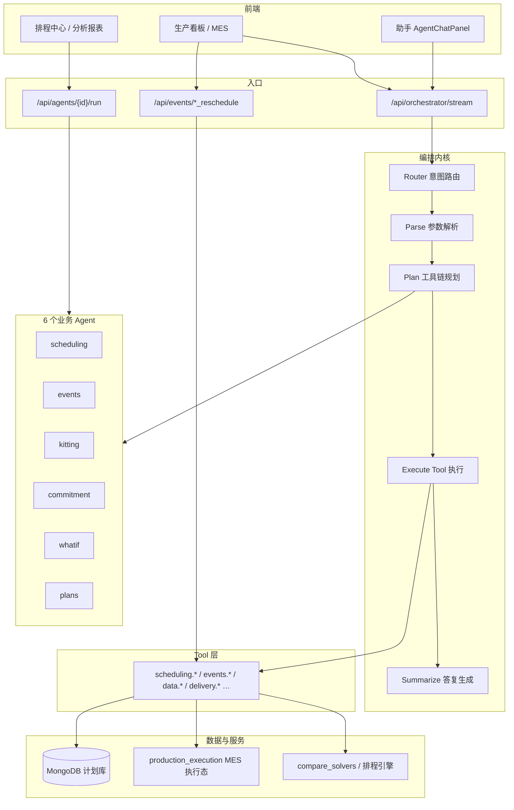
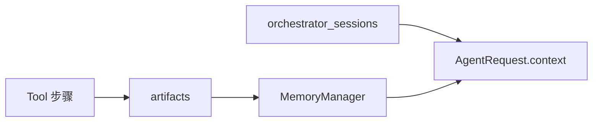

# MetaForge 智能体功能清单

> **文档索引**：[`docs/README.md`](README.md)  
> 更新：2026-05-31  
> 架构：**编排器 + 领域 Agent + Tool**，主路径 **LLM 优先（GLM）**，规则负责护栏、离线回退与结构化映射。  
> 统一入口：`POST /api/orchestrator/stream`（SSE）、`POST /api/orchestrator/preview`（仅预览计划）  
> 也可直连：`POST /api/agents/{id}/run`  
> 前端助手：`AgentChatPanel`；MES 异常重排可走 REST：`POST /api/events/*_reschedule`

---

## 系统架构概览

### 分层结构



**一句话**：用户自然语言 → **路由到一个 Agent** → **生成 Tool 步骤链** → **调用确定性后端** → **LLM 组织中文答复**；排程/重排结果可写回计划库与 MES 甘特。

### 标准请求链路（编排器）

实现：`orchestrator/stream.py`、`orchestrator/preview.py`

| 阶段 | 职责 | 主要模块 | LLM / 规则 |
|------|------|----------|------------|
| **Route** | 选一个业务 Agent | `router.resolve_agent_route` | GLM `router` 节点；失败 → `_rule_fallback_resolve` |
| **Guard** | 纠正误路由 | `_apply_route_guards` | 规则：计划库→plans、故障/插单→events、插单续聊→events |
| **Plan** | 生成 Tool 步骤 | `BaseAgent.build_plan` → `llm_plan` | GLM `plan`（`LLM_PLAN_AGENTS`）；失败 → 各 Agent `build_rule_plan` |
| **Parse** | 结构化意图/事件 | `resolve_parse_phase` | scheduling：`resolve_schedule_intent`；events：`resolve_event_envelope` |
| **Execute** | 逐步执行 Tool | `BaseAgent._run_single_step` → `run_tool` | 确定性 Python |
| **Summarize** | 车间可读摘要 | `finalize` → `summarize` | GLM（`LLM_SUMMARIZE_ENABLED`）；失败用 artifacts 摘要 |
| **Persist** | 排程/重排落库 | `_maybe_persist_schedule_to_plan` | 覆盖已有排程 → HITL `pending_confirm` |

预览模式（`/api/orchestrator/preview`）只执行 Route + Plan + Parse，**不跑 Tool**，用于助手展示「执行计划」。

### LLM 节点（`orchestrator/llm/chain.py`）

| 节点 | 用途 |
|------|------|
| `router` | 消息 → agent_id + intent |
| `scheduling` | 排程意图 JSON |
| `event` | 异常事件 envelope |
| `plan` | Agent 内 Tool 链 |
| `plans_intent` | 计划库 CRUD 意图 |
| `insert_job_followup` | 插单工艺多轮补全 |
| `react_step` / `reflect` | ReAct 与失败反思（可选） |
| `summarize` | 最终中文总结 |

Prompt：`orchestrator/llm/prompts.py`；解析：`parsers.py`；模型：智谱 GLM（`LlmClient`）。

### Tool 层

- 注册：`tools/registry.py`，启动时 `tools/load_all.py` 加载
- 契约：`ToolContext`（`custom_data`、`plan_id`、`artifacts`、`extras`）+ `ToolResult`
- 目录：`scheduling/`、`events/`、`data/`、`delivery/`、`material/`、`kitting/`、`compare/`、`execution/`

**原则**：LLM 负责理解、规划、表述；**甘特计算、R0/R1/R2、物料仿真** 均在 Tool/Service 内完成。

### 会话与记忆



- **Session**：`orchestrator/session.py`（Mongo / 内存），跨轮保留 `artifacts`、插单 `insert_job_intake`
- **MemoryManager**：`memory/manager.py`（working / scheduling / episodic）
- **上下文增强**：`_enrich_orchestrator_context` 按 `plan_id` 加载工单；MES 运行时注入 `production_execution`

### LLM 与规则分工

| 层 | LLM 负责 | 规则负责 |
|----|----------|----------|
| 路由 | 主路径分类 | plans / 故障 / 插单续聊 **guard**；离线 **fallback** |
| 解析 | scheduling、events 主解析 | 离线校验、`parse_plan_intent` |
| 规划 | 可配置 Agent 的 Tool 链 | events 默认 6 步规则链；intent_type→Tool **映射** |
| 执行 | 无 | 全部 Tool |
| 答复 | summarize | artifacts 内 `summary_zh` 回退 |

### 常用环境变量

| 变量 | 说明 |
|------|------|
| `LLM_ENABLED=1` | 启用 GLM |
| `LLM_ROUTER=glm` | 路由走 LLM（`rule`/`off` 仅规则） |
| `LLM_PLAN_ENABLED=1` | Agent 内 Plan 走 LLM |
| `LLM_PLAN_AGENTS` | 逗号分隔，如 `scheduling,events,kitting,commitment,whatif` |
| `LLM_SUMMARIZE_ENABLED=1` | 最终答复 summarize |
| `LLM_TIMEOUT_SEC=60` | 调用超时 |
| `LLM_REACT` | 开启 scheduling/events 的 ReAct 循环（可选） |

---

## 路由总览

```
用户消息
  ├─ 显式 intent 参数 → 指定 Agent（router: explicit）
  ├─ 会话 pending_route_hint → 续跑指定 Agent
  ├─ GLM Router（主路径，router: llm）
  ├─ 后验 Guard（router: rule_override）
  │     ├─ 计划库话术 → plans
  │     ├─ 改交期/插单/故障等 → events（防误判 commitment）
  │     └─ 插单工艺续聊 → events
  └─ 关键词规则回退（router: rule / rule_fallback，GLM 关闭或失败）
```

路由版本标识：`ROUTER_BUILD_ID`（如 `2026-05-31-llm-first-guards-v2`），可在 `/api/llm/status`、route-debug 核对。

| intent | agent_id | 中文名 | 场景代号 |
|--------|----------|--------|----------|
| `schedule` | `scheduling` | 智能排程 | 排程 |
| `reschedule` | `events` | 异常重排 | A |
| `kitting` | `kitting` | 齐套顾问 | B |
| `commitment` | `commitment` | 交期承诺 | C |
| `whatif` | `whatif` | 方案对比 | D |
| `plans` | `plans` | 计划管理 | F |

元数据注册：`src/metaforge/agents/registry_meta.py`（与上表一致）。

---

## 1. 智能排程（排程计算）

| 项 | 内容 |
|----|------|
| **智能体** | `scheduling` |
| **路由** | GLM Router → `schedule`；回退默认 scheduling |
| **Plan** | GLM `plan`（`LLM_PLAN_AGENTS` 含 scheduling 时）；规则：`resolve_schedule_intent` → intent_type 映射 Tool 链 |
| **工具链** | `scheduling.parse_intent` → `scheduling.run`；目录查询 `scheduling.list_catalog`；含糊时 `scheduling.ask_clarification` |
| **排程落库** | 话术含「落库/保存到数据库」或 `params.persist_after=true`：`data.load_plan`（可选）→ 排程链 → `delivery.assess` → `data.propose_persist`；编排器亦可后置 `_maybe_persist_schedule_to_plan`（覆盖已有排程 → HITL） |
| **兼容** | `intent=pipeline` 与 `POST /api/agents/pipeline/run` 仍映射到本 Agent（已废弃别名） |
| **可选** | `LLM_REACT=1` 时 ReAct 循环 |
| **完成度** | 后端 95% / 前端 90% |

### 示例问题

- 用禁忌搜索和 SPT 对比一下排程
- 给当前工单做交付优先排程
- 用遗传算法排产，权重交期 0.7
- 有哪些算法可以用？
- 支持什么求解器？
- 做一个生产计划并排程落库
- 对当前计划排程并保存到数据库

---

## 2. 异常重排（异常事件）

| 项 | 内容 |
|----|------|
| **智能体** | `events` |
| **路由** | GLM Router → `reschedule`；Guard 强制动态事件进 events；回退含「重排/故障/插单」 |
| **Plan** | **默认规则 6 步链**（稳定、少一次 GLM）；插单多轮补全走 `merge_insert_job` 规则链 |
| **工具链** | `execution.get_state`（可选）→ `events.parse_event` → `events.check_insert_job` → `events.reschedule` → `delivery.compare_commitment`（可选）→ `delivery.explain_impact`；目录 `events.list_event_types` |
| **重排内核** | `events.reschedule` → `event_reschedule.dispatch_event_reschedule` |
| **完成度** | 后端 95% / 前端 90% |
| **前置** | 生产看板「MES 当前执行」启动后，读取 `sim_time` 与 `baseline_gantt`；故障时刻为 **仿真时刻**（非墙钟） |
| **UI 入口** | 看板「异常重排」；「查看影响评估」；分析报表同数据源 |
| **对比语义** | **R0** 原计划 / **R1** 故障不重排（`propagate_breakdown_on_gantt`）/ **R2** 冻结已开工 + 原算法残段重排 |

### 影响评估数据

- 响应字段：`impact_report`（含 `r0_gantt` / `r1_gantt` / `r2_gantt`、`delay_details`、`commitment_changes`、`scenarios`）或顶层 `impact_gantt`
- MES 落库：`last_impact_summary`、`last_impact_gantt`、`last_reschedule_results`
- 前端：`loadImpactAssessmentForPlan`、`activeImpactReport`（Pinia，取更完整的一份）

### 示例问题

- 3 号机坏了 4 小时，帮我重排（需先看板开始执行；默认故障时刻=当前仿真时刻）
- 紧急插单：工单 J005，交期后天
- 工单 A 的交期改成下周五
- 2 号产线计划停机 2 小时
- 物料 M001 延迟 3 天到货
- 取消工单 J003
- 支持哪些异常事件？

---

## 3. 齐套顾问（齐套 / BOM）

| 项 | 内容 |
|----|------|
| **智能体** | `kitting` |
| **路由** | GLM Router → `kitting`；**Guard**：含「缺料/齐套/物料」且问延期/工单影响时，强制纠正（防误判 commitment） |
| **Plan** | GLM `plan`（`LLM_PLAN_AGENTS` 含 kitting 时）+ 规则回退 |
| **工具链** | `material.check_static` → `material.compute_delays`（可选）→ `kitting.build_report`；或先 `scheduling.run` 再 `material.predict` |
| **完成度** | 后端 85% / 前端 60% |

### 示例问题

- 当前工单物料齐套吗？
- 检查一下 BOM 缺料情况
- 这批订单能否按时开工？
- 缺料会导致哪些工单延期？
- 先排程再预测物料消耗

---

## 4. 交期承诺（交期评估）

| 项 | 内容 |
|----|------|
| **智能体** | `commitment` |
| **路由** | GLM Router → `commitment`；**非**「改交期并重排」（events Guard）；**非**「缺料导致哪些工单延期」（kitting Guard） |
| **注意** | 默认**不重新排程**、不触发落库确认；复用计划库已有 `schedule_results` |
| **Plan** | GLM `plan` + 规则回退 |
| **工具链** | `scheduling.run`（可选）→ `delivery.assess` → `delivery.customer_script` |
| **完成度** | 后端 85% / 前端 50% |

### 示例问题

- 这批订单交期有没有风险？
- 评估一下当前排程的交付情况
- 客户问能不能 5 月 15 日交货，帮我评估
- 生成一段给客户的交期说明话术
- 哪些工单可能延期？

---

## 5. 方案对比（What-if）

| 项 | 内容 |
|----|------|
| **智能体** | `whatif` |
| **路由** | GLM Router → `whatif` |
| **Plan** | GLM `plan` + 规则回退 |
| **工具链** | `compare.variants`（内部可调用 `scheduling.run` / `events.reschedule` / `delivery.assess`） |
| **完成度** | 后端 85% / 前端 30%（无专用 UI，主要靠助手） |

### 示例问题

- 对比交付优先和产能优先两种策略
- 如果按交期优先和按产能优先排，哪个更好？
- 假设用 SPT 和禁忌搜索各跑一遍，对比一下
- 比较不同排程方案的风险差异

---

## 6. 计划管理（计划库 CRUD）

| 项 | 内容 |
|----|------|
| **智能体** | `plans` |
| **路由** | `parse_plan_intent` 精确命中 → plans；否则 GLM Router + **plans guard** |
| **意图解析** | 规则 → GLM `plans_intent` → 规则兜底（`plans/resolve_intent.py`） |
| **工具链** | 见下表 |
| **完成度** | 后端 95% / 前端 90% |

### 操作与工具

| 操作 | 工具 | 完成后跳转 APS |
|------|------|----------------|
| 新建 | `data.create_plan` | ✅ |
| 查看具名计划 | `data.bind_plan`（view 意图） | ✅ |
| 加载/绑定 | `data.bind_plan` | ✅ |
| 列出全部 | `data.list_plans` | ❌ |
| 重命名 | `data.rename_plan` | ✅ |
| 复制 | `data.duplicate_plan` | ✅ |
| 改状态 | `data.update_status` | ✅ |
| 删除 | `data.delete_plan` | ❌ |

### 示例问题

**新建**

- 新建计划试产01
- 创建一个名为「春季批次」的计划

**查看 / 加载（跳转 APS）**

- 查看计划 sss
- 加载计划试产01
- 打开计划 A

**列出（不跳转）**

- 列出所有计划
- 查看全部计划

**修改（跳转 APS）**

- 把计划 A 改名为计划 B
- 复制计划试产01 为试产02
- 标记计划 A 为已完成

**删除（不跳转）**

- 删除计划旧版
- 删掉计划试产01

---

## 7. schedule 与 plans 易混对照

| 用户说法 | 正确路由 | 原因 |
|----------|----------|------|
| 新建计划 a | `plans` | 操作计划库档案 |
| 查看计划试产01 | `plans` | 绑定具名计划，非列全表 |
| 用禁忌搜索排程 | `scheduling` | 选算法算甘特，非建库 |
| 给当前工单做交付优先排程 | `scheduling` | 排程计算 |
| 排程并保存到数据库 | `scheduling` | 排程 + HITL 落库（原 pipeline 已合并） |
| 3 号机坏了帮我重排 | `events` | 动态事件 + 重排，非交期风险评估 |

---

## 8. MES 与双入口对照

| 路径 | 入口 | 说明 |
|------|------|------|
| **助手编排** | `POST /api/orchestrator/stream` | SSE trace；结束后 `attach_schedule_results_for_client` 提升 `schedule_results` / `impact_report` |
| **看板 REST** | `POST /api/events/machine_breakdown_reschedule` 等 | 同一 `dispatch_event_reschedule`，写回 `production_execution` |
| **执行态** | `GET /api/execution/state` | `baseline_gantt`、`sim_time`、`last_impact_summary`、`last_impact_gantt` |

重排成功后 MES：`baseline_gantt` 更新为 R2；影响评估从执行态或计划库 `impact_summary` 加载。

---

## 9. 未覆盖 / 已知限制

- MCP 适配：骨架已有（`GET /api/mcp/status`），默认 `MCP_ENABLED=0`
- 权限审计：最小日志 `audit_log`（`AUDIT_LOG_ENABLED=1`）；完整 RBAC 待定（P5-D）
- HFSP：搁置
- whatif / commitment：助手内 `AgentResultCards` 展示；无独立报表页
- kitting：助手 + 物料页；BOM 与库存自动同步仍待加强
- 路由验收：`tests/test_router_phrases.py`（20 条话术，规则路径）
- 访问 `http://127.0.0.1:8008/new-ui/` 需先 `cd frontend && npm run build` 同步静态资源；开发推荐 `npm run dev`（5173）

---

## 10. 相关 API

| 接口 | 说明 |
|------|------|
| `POST /api/orchestrator/stream` | 统一编排（SSE，主入口） |
| `POST /api/orchestrator/preview` | 预览 Route + Plan + Parse，不执行 Tool |
| `GET /api/orchestrator/session/{id}` | 会话状态 |
| `GET /api/orchestrator/session/{id}/artifacts` | 会话 artifacts |
| `GET /api/orchestrator/route-debug?message=` | 路由调试 |
| `POST /api/agents/{id}/run` | 直连指定 Agent |
| `GET /api/agents/registry` | Agent 元数据 |
| `GET /api/tools/registry` | Tool 目录 |
| `GET /api/llm/status` | GLM 启用与路由版本 |
| `GET /api/execution/state` | MES 执行态 |
| `POST /api/events/machine_breakdown_reschedule` | 设备故障 R0/R1/R2 |
| `POST /api/events/insert_order_reschedule` | 插单重排 |
| `POST /api/events/due_date_reschedule` | 改交期重排 |

---

## 11. 代码索引（便于对照）

更多文档见 [`docs/README.md`](README.md)。

| 模块 | 路径 |
|------|------|
| 编排流式 | `src/metaforge/orchestrator/stream.py` |
| 路由 | `src/metaforge/orchestrator/router.py` |
| LLM 链 | `src/metaforge/orchestrator/llm/chain.py` |
| Agent 基类 | `src/metaforge/agents/base.py` |
| 业务 Agent | `src/metaforge/agents/{scheduling,events,…}.py` |
| 事件重排服务 | `src/metaforge/services/event_reschedule.py` |
| MES 执行态 | `src/metaforge/services/production_execution.py` |
| 影响评估（前端） | `frontend/src/utils/impactReport.js` |
| FastAPI 入口 | `tests/main.py` |
