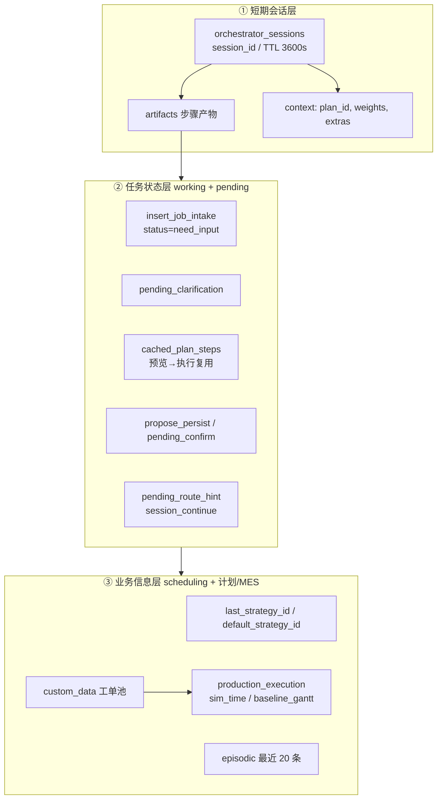

# 简历项目经历 — Multi-Agent 制造排程（对齐个人版式）

> 版式参考：项目名 + 时间 + 技术栈 + 项目背景 + 工作内容 + 效果评测。  
> 数据来源于仓库代码与 pytest；**无实测数据的指标未写入**。请按实际参与周期修改时间。  
> **推荐项目名（含 Agent，不含产品代号）：** 见文末「项目命名备选」。

---

## 版本一（投递 AI Agent / 大模型应用）

**Multi-Agent 制造排程智能体系统**  
（备选：`车间 Multi-Agent 排产与异常调度系统` / `制造领域 Multi-Agent 编排平台`）
**2025/10 – 2026/05**（多智能体阶段；全项目可写 2025/06 – 2026/05）

**技术栈：** Python、FastAPI、Uvicorn、自研多智能体编排器、智谱 GLM（OpenAI 兼容 Chat Completions）、自研 `LlmNode` 任务链（对标 LangGraph/LangChain 节点思想，**未引入 LangGraph/LangChain SDK**）、Plan-and-Solve、白名单 Tool 调用、ReAct/Reflect、JSON 结构化解析、SSE、MongoDB（Motor）、Vue3/Vite/Element Plus、Pydantic、pytest

**项目背景：** 面向离散制造车间 Job Shop 排产与生产执行场景，针对传统 APS「功能分散、口语难用、异常重排与落库割裂」等问题，从零搭建 **6 专责 Agent + 统一编排器**，覆盖【意图路由—Tool 规划—确定性执行—会话落库】链路；在 **6 类业务意图、30 个 Tool、20 条标准车间话术** 上完成规则回归与 GLM 联调冒烟验证。

**工作内容：**

1、设计 **6 专责 Agent**（智能排程 / 异常重排 / 齐套 / 交期承诺 / 方案对比 / 计划管理）+ 统一编排器，单请求 **仅路由 1 个 Agent**；实现 `POST /api/orchestrator/stream` **SSE 流式**输出 Route→Plan→Parse→Execute→Summarize 全链路轨迹，并提供 `/preview` 仅预览执行计划。

2、构建 **GLM 优先 + 规则兜底** 的 LLM 层：落地 **9 类 Prompt 节点**（router、排程/事件解析、plan、计划库意图、插单续聊、ReAct、Reflect、summarize）；配套 JSON 结构化输出校验；GLM 超时自动 **rule_fallback**；设计 **4 组路由 Guard**（计划库、缺料齐套、改交期重排、工单延期问询）降低误分到排程/交期 Agent。

3、实现 **Plan-and-Solve** 与白名单 **30 个 Tool**（见下文明细表）：排程 4 + 计划库 10 + 异常与执行态 6 + 交期 4 + 物料齐套 4 + 对比 1 + 记忆 1；对接 **6 策略模板 × 14 求解器**（`solver_registry`）与 **8 类** `event_type`；统一 `events.reschedule` 输出 **R0/R1/R2** 与 `impact_report`；落库 **HITL**（`propose_persist` + 15min `confirm_token`）。

4、**三层记忆**（会话 artifacts / 任务 working+pending / 业务 scheduling+计划+MES）+ **追问与缓存**：插单 `need_input`、排程 `pending_clarification`、`preview` 缓存 Plan、`pending_route_hint` 续聊免重复路由；summarize 仅传摘要字段并截断 token；前端 `AgentChatPanel` 卡片化展示交期/对比/齐套。

**效果评测：**

1、搭建 **L2/L3 分层自动化评测**（65 条话术 1:1 对齐）：L2 Preview（路由+Plan+Parse）通过率 **87.3%**（55/63）；L3 端到端 Exec 核心冒烟 **87.5%**（14/16）；**异常重排 Agent L3 全量 14/14**；events/plans/对抗路由 L2 均为 **100%**。

2、建立 **规则 + GLM** 双轨验收：`test_router_phrases.py` **20/20** 条车间话术命中预期 Agent；`glm_smoke` **21** 条 + Agent E2E **pytest 70+** 回归；编排器 **GLM 关闭可 rule_fallback** 降级排产。

3、架构上 **LLM 不直接算甘特**：排程/重排/物料在 Tool 完成，结果可复现；详见 `[agent-effectiveness-evaluation.md](agent-effectiveness-evaluation.md)`。

---

## 版本二（投递后端 / 全栈 / 制造信息化）

**制造 APS + Multi-Agent 排产调度平台**  
**2025/06 – 2026/05**

**技术栈：** Python、FastAPI、Uvicorn、Motor、MongoDB、Vue3、Vite、Element Plus、Pinia、ECharts、JSSP、PyTorch（DQN/PPO 等求解器）、元启发/强化学习求解器、REST、SSE、6 路 `/api/agents` 接口

**项目背景：** 基于 Job Shop Scheduling 的车间级 APS 与生产执行产品，支持计划库工单管理、多算法排程对比、看板仿真与异常重排；后接入 **Multi-Agent 自然语言编排**，形成 **REST 看板 + Agent 对话双入口** 共用同一重排与持久化内核。

**工作内容：**

1、搭建 **FastAPI** 统一后端（`tests/main.py`），暴露 `/api/run` 多算法排程、**8 类** `POST /api/events/*_reschedule`、`/api/execution/state` 执行态、计划库 CRUD、**6 个** `/api/agents/{id}/run` 及编排器接口；MongoDB 存储 `work_orders`、会话与 HITL 待确认队列。

2、排程引擎产品化：`solver_registry` 注册 **14** 种算法（SPT/TS/GA/SA/ACO/DQN/PPO 等），`compare_solvers` 输出 makespan、拖期、能耗等多指标；APS 支持策略权重、停机窗口、异步长任务与甘特/瓶颈报表。

3、生产异常三场景重排：`production_execution` 维护 `baseline_gantt` 与仿真时钟；故障等事件生成 **R1 时间推演** + **R2 冻结残段重排**；影响评估写回计划库与执行态，前端 `ImpactDualGantt` / `impactReport` 统一解包多层 `impact_summary`。

4、Vue3 单页应用（`/new-ui`）：排程中心、生产看板、分析报表、物料库存、智能助手；`PersistConfirmDialog` 覆盖式落库确认；构建产物单端口 **8008** 部署。

**效果评测：**

1、核心模块 pytest 覆盖：计划 BSON 序列化、HITL 落库、设备故障 R0/R1/R2、编排 Session 续跑、物料 BOM 等；与助手共用的 `event_reschedule` 保证看板按钮与对话重排 **行为一致**。

2、计划库 + 执行态 + 排程快照一体化后，异常重排结果可回写甘特并在分析页对比「重排前/传播/重排后」，支撑车间异常决策演示（本地算例下单次 `scheduling.run` 约 **百毫秒级**，视工单规模与算法数量浮动）。

---

## 可直接粘贴的合并版（仅 Agent 岗，一段式）

**Multi-Agent 制造排程智能体系统 | 2025/10 – 2026/05**  
技术栈：Python、FastAPI、智谱 GLM、自研 Agent 编排（LlmNode 链 + Plan-and-Solve + Tool 白名单）、SSE、MongoDB、Vue3、pytest  
项目背景：面向车间 JSSP 排产与生产异常调度，针对口语难用、意图混杂、重排与落库割裂等问题，搭建【路由—规划—Tool 执行—HITL 落库】Multi-Agent 链路，在 6 类意图、30 个 Tool、20 条标准话术上完成自动化验收。  
工作内容：① 6 专责 Agent + SSE 编排器，GLM 优先 + 4 组 Guard/规则回退。② 白名单 30 Tool、6 策略×14 求解器、8 类异常事件→R0/R1/R2，HITL 落库。③ 三层记忆（会话/任务 pending/业务 scheduling）+ 追问与 Plan 缓存、summarize 截断降 token；助手轨迹与结果卡片。  
效果评测：L2 自动化 65 条话术通过率 87%；L3 端到端核心场景 87.5%，异常重排 L3 全量 14/14；20 条规则路由 100% 命中；70+ pytest + GLM 冒烟回归；LLM 关闭可规则降级，甘特由确定性引擎计算。

---

## 与 SU7 RAG 项目并列时的写法提示

| 维度  | SU7 手册 RAG         | Multi-Agent 制造排程                                |
| --- | ------------------ | ----------------------------------------------- |
| 领域  | 文档问答、检索增强          | 制造排程、Multi-Agent、Tool 编排                        |
| 模型  | Qwen LoRA + Rerank | 智谱 GLM（`requests` 直调）+ 自研 LlmNode 链，非 LangGraph |
| 评测  | RAGas 语义分、延迟压测     | 路由命中率、pytest、三场景甘特                              |
| 亮点词 | 混合检索、蒸馏 SFT        | Plan-and-Solve、HITL、R0/R1/R2                    |

两项目可同时体现：**端到端 LLM 应用搭建**（RAG）+ **Multi-Agent 与领域 Tool**（制造排程），避免重复堆砌「调用 GLM」而无差异。

---

## 项目命名备选（简历标题，均含 Agent / Multi-Agent）

| 优先级   | 项目名                                           | 说明                          |
| ----- | --------------------------------------------- | --------------------------- |
| ★ 主推  | **Multi-Agent 制造排程智能体系统**                     | Agent 岗最贴切；中英文关键词都有         |
| 备选 1  | **车间 Multi-Agent 排产与异常调度系统**                  | 突出口语排产 + 8 类异常重排            |
| 备选 2  | **制造排程 Multi-Agent 编排平台**                     | 强调编排器、Plan-and-Solve        |
| 备选 3  | **离散制造 Multi-Agent 生产调度 Agent 平台**            | 「Agent」出现两次，略长，投递 Agent 岗可用 |
| 全栈副标题 | **制造 APS + Multi-Agent 排产调度平台**               | 版本二已采用；兼顾 APS 与 Agent       |
| 英文简历  | **Shop-Floor Multi-Agent Scheduling Copilot** | 外企/英文 CV 一行标题               |

**写法技巧：** 主标题用上表之一；若版面紧，副标题补一句：`6 专责 Agent · 智谱 GLM · Plan-and-Solve · 30 Tools`。

---

## Agent / 大模型技术栈（与代码一致，面试可照此说）

| 类别   | 本项目实际用法                                                                                                                                               | 简历勿写（未接入）                   |
| ---- | ----------------------------------------------------------------------------------------------------------------------------------------------------- | --------------------------- |
| 大模型  | 智谱 **GLM**（`glm-4.5-air` 等），`ZHIPU_API_KEY` + OpenAI 兼容 `/chat/completions`                                                                           | vLLM、本地 Qwen 微调             |
| 编排框架 | **自研** `orchestrator`：`Route → Plan → Parse → Execute → Summarize`；`llm/chain.py` 的 `**LlmNode` 注册表**（注释对标 LangGraph 节点，**依赖里无 langgraph/langchain**） | LangGraph、LangChain、AutoGen |
| 范式   | **Plan-and-Solve**（GLM 出 Tool 步骤）+ 确定性 Tool 执行；可选 **ReAct / Reflect** 节点                                                                              | 纯 ReAct 端到端算甘特              |
| Tool | `metaforge.tools` 白名单注册 ~30 个，Agent `allowed_tools` 约束                                                                                                | MCP 生产级（仅 Phase6 骨架，默认关）    |
| 流式   | `POST /api/orchestrator/stream` **SSE**                                                                                                               | WebSocket                   |
| 记忆   | Mongo/内存 **Session**、`artifacts`、插单 `insert_job_intake` 续聊                                                                                            | 向量库 RAG                     |
| 护栏   | 规则 Guard + `rule_fallback`（GLM 超时/关闭）                                                                                                                 | 全靠 prompt                   |
| 后端   | FastAPI、Pydantic（`tests/main.py` API 模型）、pytest                                                                                                       | Linux/Docker 非必需            |

开发环境为 **Windows**；部署为本地 `uvicorn` + 可选 Mongo，无 Docker 镜像要求。

## 简历表述技术明细（面试对照）

> 本节把简历/合并版里「30 Tool、6 策略、14 求解器、8 异常、三层记忆、追问与缓存」等说法**逐项对齐仓库实现**，避免面试被追问时对不上号。  
> 代码索引：`src/metaforge/tools/`、`src/metaforge/utils/solver_registry.py`、`src/metaforge/memory/`、`src/metaforge/orchestrator/`。

---

### A. 30 个白名单 Tool（`GET /api/tools/registry`）

启动时 `tools/load_all.py` 注册 **恰好 30 个** Tool（命名规范 `域.动作`）。各 Agent 通过 `allowed_tools` 子集调用；`memory.run` 为统一记忆门面，**未**列入任一 Agent 白名单，但可被编排层/测试直接调用。

| #   | Tool ID                        | 中文职责                                                          | 典型调用方                                |
| --- | ------------------------------ | ------------------------------------------------------------- | ------------------------------------ |
| 1   | `scheduling.parse_intent`      | 自然语言/参数 → 求解器列表、策略 ID、权重、`intent_type`                        | scheduling                           |
| 2   | `scheduling.run`               | 封装 `compare_solvers`，产出 `schedule_results` 甘特与指标              | scheduling、kitting、commitment、whatif |
| 3   | `scheduling.list_catalog`      | 列出 **6 种策略模板 + 14 种求解器** 目录                                   | scheduling                           |
| 4   | `scheduling.ask_clarification` | 目标含糊时返回追问，不跑排程                                                | scheduling                           |
| 5   | `data.load_plan`               | 按 `plan_id` 加载工单进 `custom_data`                               | scheduling                           |
| 6   | `data.propose_persist`         | 生成 HITL 落库 `confirm_token`（默认 15min 有效）                       | scheduling                           |
| 7   | `data.confirm_persist`         | 校验 token（实际写库走 API）                                           | scheduling                           |
| 8   | `data.create_plan`             | 新建计划档案                                                        | plans                                |
| 9   | `data.bind_plan`               | 绑定/查看具名计划（view 意图）                                            | plans                                |
| 10  | `data.list_plans`              | 列出全部计划                                                        | plans                                |
| 11  | `data.rename_plan`             | 重命名计划                                                         | plans                                |
| 12  | `data.duplicate_plan`          | 复制计划                                                          | plans                                |
| 13  | `data.update_status`           | 改计划状态（如已完成）                                                   | plans                                |
| 14  | `data.delete_plan`             | 删除计划                                                          | plans                                |
| 15  | `execution.get_state`          | 读 MES `sim_time`、`baseline_gantt`、最近影响摘要                      | events                               |
| 16  | `events.list_event_types`      | 列出支持的 **8 类** 动态事件说明                                          | events                               |
| 17  | `events.parse_event`           | 口语 → `event_type` + `params`（含插单草稿）                           | events                               |
| 18  | `events.check_insert_job`      | 校验插单工艺；不齐 → `status=need_input` + 追问文案                        | events                               |
| 19  | `events.merge_insert_job`      | 多轮续聊合并插单工艺（规则优先，可选 GLM）                                       | events                               |
| 20  | `events.reschedule`            | 统一重排内核 → `dispatch_event_reschedule`，产出 R0/R1/R2              | events、whatif                        |
| 21  | `delivery.assess`              | 交期风险、拖期统计                                                     | scheduling、commitment、whatif         |
| 22  | `delivery.compare_commitment`  | 重排前后交期承诺变化对比                                                  | events                               |
| 23  | `delivery.explain_impact`      | 将 `impact_report` 转为车间可读解读                                    | events                               |
| 24  | `delivery.customer_script`     | 生成对客户交期说明话术                                                   | commitment                           |
| 25  | `material.check_static`        | BOM 静态齐套检查                                                    | kitting                              |
| 26  | `material.compute_delays`      | 缺料导致工单延期推演                                                    | kitting                              |
| 27  | `material.predict`             | 排程后物料消耗仿真                                                     | kitting                              |
| 28  | `kitting.build_report`         | 聚合齐套/缺料报告                                                     | kitting                              |
| 29  | `compare.variants`             | What-if：多策略/多算法变体并排对比                                         | whatif                               |
| 30  | `memory.run`                   | 记忆读写：`get/set/patch/summary`（working / scheduling / episodic） | 编排/调试                                |

**按域汇总（30 = 4+10+6+4+4+1+1）：**

| 域                          | 数量  | Tool 列表                                                                                          |
| -------------------------- | --- | ------------------------------------------------------------------------------------------------ |
| `scheduling.`*             | 4   | parse_intent、run、list_catalog、ask_clarification                                                  |
| `data.*`                   | 10  | load_plan、propose_persist、confirm_persist、create、bind、list、rename、duplicate、update_status、delete |
| `events.*` + `execution.*` | 6   | get_state、list_event_types、parse_event、check_insert_job、merge_insert_job、reschedule              |
| `delivery.*`               | 4   | assess、compare_commitment、explain_impact、customer_script                                         |
| `material.*` + `kitting.*` | 4   | check_static、compute_delays、predict、build_report                                                 |
| `compare.*`                | 1   | variants                                                                                         |
| `memory.*`                 | 1   | run                                                                                              |

**6 个 Agent 白名单并集 = 29 个**（不含 `memory.run`）；全库注册 **30 个**。

---

### B. 6 种求解策略模板（`STRATEGY_TEMPLATES`）

定义于 `src/metaforge/agent/scheduling_agent.py`，与 APS「策略配置」、`scheduling.list_catalog`、`resolve_schedule_intent` 一致。每种策略对应一组多目标权重 `weights`（用于 `score = Σ w_i × metric_i`）：

| strategy_id    | 中文名    | 业务侧重   | 权重特点（相对默认）                           |
| -------------- | ------ | ------ | ------------------------------------ |
| `balanced`     | 综合平衡   | 默认     | makespan=1.0，拖期=0.5，能耗=0.05，负载 CV=10 |
| `delivery`     | 交付优先   | 少拖期、急单 | **weighted_tardiness_total=2.0** 抬高  |
| `cost`         | 成本优先   | 分时电价   | **energy_cost=2.5** 抬高               |
| `balance_load` | 负载均衡   | 机台均衡   | **machine_busy_cv=20** 抬高            |
| `makespan`     | 完工时间最短 | 整体周期   | **makespan=3.0** 抬高                  |
| `throughput`   | 吞吐优先   | 产能/产出  | makespan=2.0，略偏周期                    |

自然语言命中：`SchedulingAgent._match_strategy` / GLM `scheduling` 节点输出 `strategy_id` → `scheduling.parse_intent` → `scheduling.run` 传入 `compare_solvers`。

---

### C. 14 种求解器（`solver_registry.SOLVER_REGISTRY`）

注册于 `src/metaforge/utils/solver_registry.py`，`scheduling.run` 与 `/api/solvers/catalog` 共用。

| #   | solver_id    | 中文名           | 族       | 搜索阶段是否吃 weights |
| --- | ------------ | ------------- | ------- | --------------- |
| 1   | `spt`        | 最短加工时间 SPT    | 规则启发    | 否（事后评分）         |
| 2   | `lpt`        | 最长加工时间 LPT    | 规则启发    | 否               |
| 3   | `mwkr`       | 剩余工作量最大 MWKR  | 规则启发    | 否               |
| 4   | `mopnr`      | 剩余工序数最多 MOPNR | 规则启发    | 否               |
| 5   | `edd`        | 最早交期 EDD      | 规则启发    | 否               |
| 6   | `ts`         | 禁忌搜索 Tabu     | 元启发     | **是**           |
| 7   | `ga`         | 遗传算法 GA       | 元启发     | **是**           |
| 8   | `sa`         | 模拟退火 SA       | 元启发     | **是**           |
| 9   | `aco`        | 蚁群 ACO        | 元启发     | **是**           |
| 10  | `q`          | Q-Learning    | 强化学习    | 否（主优化 makespan） |
| 11  | `dqn-naive`  | DQN 朴素版       | 强化学习    | 否               |
| 12  | `dqn-replay` | DQN 经验回放      | 强化学习    | 否               |
| 13  | `neuroevo`   | 神经进化          | 强化学习/实验 | 否               |
| 14  | `ppo`        | 近端策略优化 PPO    | 强化学习    | 否               |

口语映射：`nl_keywords` + 别名表（如「禁忌搜索」→ `ts`，「遗传」→ `ga`）。简历可写：**5 规则 + 4 元启发 + 5 RL/实验 = 14**。

---

### D. 8 类异常/动态事件（`events.list_event_types`）

`events.parse_event` / `resolve_event_envelope` 解析后，由 `events.reschedule` → `event_reschedule.dispatch_event_reschedule` 执行；看板 REST `POST /api/events/*_reschedule` 走同一内核。

| #   | event_type          | 中文    | 关键参数（摘要）                                                | REST 快捷入口（部分）                  |
| --- | ------------------- | ----- | ------------------------------------------------------- | ------------------------------ |
| 1   | `insert_order`      | 插单    | `insert_job`、`mode: local_repair|global`                | `insert_order_reschedule`      |
| 2   | `machine_breakdown` | 设备故障  | `machine_id`(0起)、`breakdown_start`、`breakdown_duration` | `machine_breakdown_reschedule` |
| 3   | `due_date_change`   | 改交期   | `due_date_changes: [{job_name, new_due_date}]`          | `due_date_reschedule`          |
| 4   | `planned_downtime`  | 计划停机  | `downtime_blocks: [{machine_id, start, end}]`           | 助手/Agent                       |
| 5   | `material_delay`    | 物料晚到  | `job_name` + `delay_hours` 或 `material_arrival`         | 助手/Agent                       |
| 6   | `priority_change`   | 调整优先级 | `changes: [{job_name, new_priority}]`                   | 助手/Agent                       |
| 7   | `order_cancel`      | 撤单/暂停 | `job_names: []`                                         | 助手/Agent                       |
| 8   | `quantity_change`   | 数量变更  | `changes: [{job_name, new_quantity}]`                   | 助手/Agent                       |

**重排输出语义（简历可一句话）：**

- **R0**：原计划基准（未重排）  
- **R1**：故障/事件时间推演，不重排剩余工序（`propagate_breakdown_on_gantt`）  
- **R2**：冻结已开工工序 + 原算法对残段重排 → 写回 `baseline_gantt`

聚合字段：`impact_report`（含 `r0_gantt` / `r1_gantt` / `r2_gantt`、`delay_details`、`commitment_changes`）。

---

### E. 三层记忆机制（会话 / 任务状态 / 业务信息）

实现：`MemoryManager`（`memory/manager.py`）+ `orchestrator/session.py` + `scheduling/context.py` 的 `ContextManager`。与简历「三层」对应关系如下：

| 层次         | 存储位置                                                                      | 存什么                                                                    | 典型用途                  |
| ---------- | ------------------------------------------------------------------------- | ---------------------------------------------------------------------- | --------------------- |
| **① 短期会话** | `orchestrator_sessions`（内存或 Mongo，`SESSION_STORE=mongo`）                  | `artifacts`、`context` 切片、`last_agent_id`、**TTL 默认 3600s**              | 多轮对话续跑、助手绑定 `plan_id` |
| **② 任务状态** | `memory_store.working` + Session `artifacts` + `ContextManager.pending_`* | 插单 `need_input`、排程 **追问** `pending_clarification`、**Plan 缓存**、HITL 待确认 | 避免每轮重新路由/重新 Plan      |
| **③ 业务信息** | `memory_store.scheduling` + `episodic` + `custom_data` / MES              | 策略偏好、最近排程摘要、情景日志；计划工单；执行态甘特                                            | 下一轮解析默认策略、报表与重排基准     |

`**memory.run` 动作：** `summary`（默认）、`get/set/patch`，scope = `working` | `scheduling` | `episodic`。

**续聊路由（降 LLM）：** `memory/pending.py` 的 `pending_route_hint` — 若存在待补全插单或待澄清排程目标，Router 直接 `session_continue` 到 `events` / `scheduling`，**跳过 GLM 路由**。

---

### F. 追问、上下文压缩与缓存（降重复 LLM 调用）

| 机制               | 实现要点                                                                                                                                                                      | 省下的 LLM 调用                                                  |
| ---------------- | ------------------------------------------------------------------------------------------------------------------------------------------------------------------------- | ----------------------------------------------------------- |
| **排程目标追问**       | 置信度低 → `scheduling.ask_clarification` + `ContextManager.set_clarification`；用户回复走 `parse_clarification_reply` / `merge_clarification_reply`，`status=pending_clarification` | 避免含糊句直接 `scheduling.run` 空跑                                 |
| **插单工艺追问**       | `events.check_insert_job` → `build_insert_job_question`；续聊 `events.merge_insert_job`（规则合并，缺口大时才 `insert_job_followup` GLM 节点）                                             | 插单续聊时 Parse 走 `planner=session_continue`，**不整句重跑 event 解析** |
| **Plan 缓存**      | `/api/orchestrator/preview` 的 `cache_plan_on_request` → `context.extras.cached_plan_steps`；`Agent.run()` 命中则 **不再 `build_plan` 调 GLM**                                    | 预览后点「执行」省 1 次 Plan LLM                                      |
| **Summarize 压缩** | `summarize_user` 只传 `plan_log[-8]` + artifacts 白名单字段；`schedule_results` 每算法只留 name/score；JSON **截断 3000 字符**                                                              | 降低 summarize token，避免把完整甘特塞进 prompt                         |
| **Parser 截断**    | `parse_summarize` 的 `summary_zh` ≤800 字；排程解析 `summary_zh` ≤200 字                                                                                                          | 控制输出长度                                                      |
| **规则兜底**         | `LLM_ENABLED=0` 或超时 → `rule_fallback` 路由/解析；**events Agent 默认规则 6 步 Plan**（稳定、少一次 Plan GLM）                                                                               | 车间断网/Key 失效仍可演示                                             |
| **路由 Guard**     | 计划库/缺料齐套/改交期重排/插单续聊 4 组规则纠正误路由                                                                                                                                            | 减少错误 Agent 上的 Plan+Execute                                  |
| **情景日志上限**       | `append_episode` / `episodic_log` 各保留最近 **20** / **5** 条摘要                                                                                                                | 防止会话存储无限膨胀                                                  |

**面试一句话：** LLM 只做「听懂、排步骤、说人话」；甘特与 R0/R1/R2 全在 Tool；记忆与缓存让**同一会话第二轮**尽量走 `session_continue` + `cached_plan_steps`，而不是重复 Router+Plan+Parse 三连调。

---

### G. 简历 bullet 与上表对照（可直接替换工作内容第 3、4 条）

**原句：**「实现 30 个 Tool，对接 6 种求解策略、14 类求解器、8 类异常事件…三层记忆…追问、上下文压缩与缓存策略」

**可改为（仍是一段，信息更实）：**

> 实现白名单 **30 个 Tool**（排程 4 / 计划库 10 / 异常 6+执行态 1 / 交期 4 / 物料齐套 4 / 对比 1 / 记忆 1），经 6 专责 Agent 子集调度；排程侧 **6 策略模板 × 14 求解器**（`solver_registry`），异常侧 **8 类 event_type** 统一 `events.reschedule` 输出 R0/R1/R2。设计会话 **artifacts + MemoryManager（working / scheduling / episodic）** 三层记忆，配合插单/排程 **追问**、`pending_route_hint` 续聊、`preview` **Plan 缓存** 与 summarize **字段白名单+截断**，降低同会话重复 GLM 调用。

---

## 使用说明

1. 时间：Git 首提约 2025-06，多智能体集中 2025-10 后；请按真实实习/项目周期改。
2. 效果评测推荐写 **L2 87% / L3 冒烟 87.5% / events L3 14/14**；勿写未复测的全量 L3 62%（含 skip 与 harness 问题，见效果评测报告）。
3. 若 HR 问「为什么不用 LangGraph」：业务 Tool 需确定性 + 车间可复现，采用 **自研节点链 + 白名单 Tool**，与 LangGraph 的图编排思想类似但未引入其运行时。
4. 详细技术索引：`[智能体功能清单.md](智能体功能清单.md)`、本节 **简历表述技术明细**、`[PRD.md](PRD.md)`。

